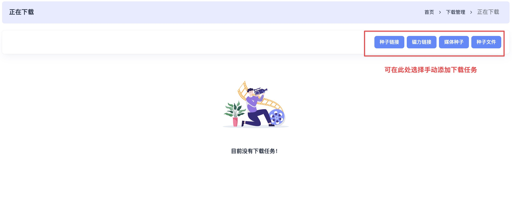

### 正在下载

#### 1. 默认下载任务展示

只有默认下载器的任务才会在此显示，右上角可手动新增下载。  

#### 2. 手动添加种子链接

输入种子链接，选择下载器、参数、目录和站点。如已设置默认配置可跳过。  

#### 3. 手动添加磁力链接

输入磁力链接，选择下载器、参数和目录。如已设置默认配置可跳过。  

#### 4. 手动添加媒体种子

输入媒体种子 ID，选择下载器、参数和目录。如已设置默认配置可跳过。  

#### 5. 手动添加种子文件

点击上传图标添加种子文件，选择下载器、参数和目录。如已设置默认配置可跳过。  

#### 6. 注意事项

若下载任务无法显示，请检查下载器版本兼容性：

- Qbittorrent ≥ 4.3.9  
- Transmission ≥ 3.0  
- 其他版本可能存在适配问题。

---
