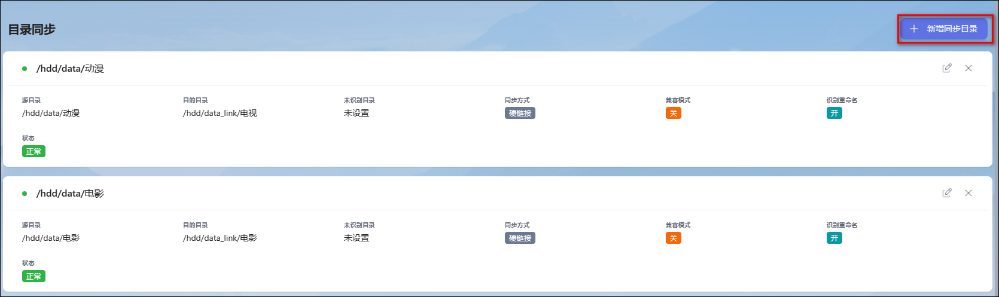

## 4、目录同步

### 工作原理

- 对源目录进行监控，当目录下的文件发生新增时进行转移处理，按设置的转移方式整理至目的目录或媒体库目录。
- 目录监控对环境有要求，部分场景下无法实现监控，参考 [目录同步不自动运行](/guide/start/problem/#目录同步不自动运行)。

### 配置说明

- **源目录**：`源目录`为需要同步的目录，源目录必须配置。
- **目的目录**：`目的目录`为识别和改名后存放的目录，目的目录未配置时将自动识别分类并转移到`媒体库目录`（此时显示为`自动`）。
- **未识别目录**：`未识别目录`为无法识别时转移的目录，未识别目录下产生的文件程序**不会主动清理**，建议不配置，未识别记录可在手动识别功能下处理。
- **同步方式**：参考 [转移方式](/docs/other/glossary/#转移方式)。
- **兼容模式**：开启`兼容模式`后，目录同步可以实时监控挂载网盘、跨系统 SMB 共享等场景，但监控性能会降低，会增加对磁盘的访问量。
- **识别并重命名**：`开启`后会对原文件进行识别并按定义的重命名格式进行重命名；`关闭`后只转移文件不识别和重命名，相当于文件同步。

