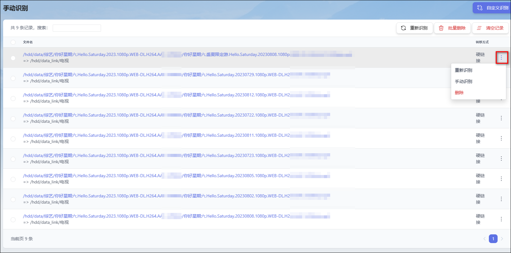
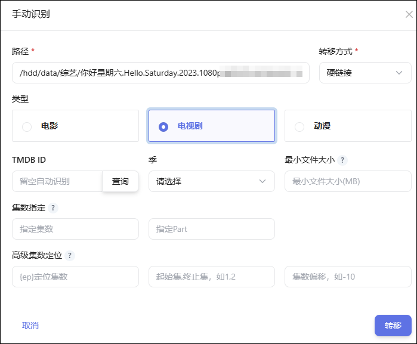

## 2、手动识别

查询未识别记录并进行手动管理，如出现大批量的正常命名文件无法识别，请优先检查 TMDB 网络连接。自动下场景下极少出现无法识别的情况。

### 重新识别

- 选择`重新识别`可以对未识别记录重新识别一次，有时因为网络连接不稳定的原因导致识别失败的，通过重新识别重新处理。

### 手动识别

选择`手动识别`通过指定 TMDB 媒体信息以及指定命名格式的方式执行文件整理。

- **类型**：根据当前文件的类型选择对应的类型，如为电视剧文件名中需要有集数，`动漫`只指动漫剧集，动漫命名格式必须选择此项。
- **TMDB ID**：点击`查询`按钮，输入`名称`查询 TMDB 媒体信息并选择，也可直接输入 TMDBID。
- **最小文件大小**：`留空`将使用基础设置中的转移最小文件大小设置，如不限制大小需输入`0`。
- **集数指定**：通过指定集数和 Part 解决无法从文件名中识别出集数和 Part 的情况。`指定集数`、`指定Part`都不填，用默认识别。
  -   **指定具体集数**：例如 `1`表示第一集, `1-2`表示第 1-2 集(1,2 合起来当作一集)，此选项优先级最高。
  -   **指定 Part**: 需符合以下正则写法`(PART[0-9ABCI]{0,2}|^CD[0-9]{0,2}|^DVD[0-9]{0,2}|^DISK[0-9]{0,2}|^DISC[0-9]{0,2})`，例如`Part1`, `PartC`, `PartIII`, `Cd1`, `Dvd2`, `Disk10`, `Disc12`。
- **高级集数定位**：`{ep}定位集数`、`起始集,终止集`、`集数偏移`都不填，用默认识别。
  -    **标定集数位置**：使用`{ep}`标字集数位置，例如：`(BD)十二国記 第45話「東の海神 西の滄海 五章」(1440x1080 x264-10bpp flac).mkv`、`(BD)十二国記 第32話「風の万里 黎明の空　九章」(1440x1080 x264-10bpp flac).mkv`，此处可以填`(BD)十二国記 第{ep}話{a}(1440x1080 x264-10bpp flac).mkv` `{ep}`表示集，`{a}`表示随意用一个变量来替代不需要的但又不一致的部分，如果除了集数外没有其余不一样的内容，则只标定`{ep}`就行。
  -    **起始集,终止集**：裁定处理集数过滤范围，例如`2,4`只取第 2 集到第 4 集。
  -    **集数偏移**：例如`{ep}`定位出集数是 11, 实际是第 1 集, 此处填`-10`, 以应付多季合集的场景。

### 自定义识别

选择`自定义识别`通过指定 路径、TMDB 媒体信息以及指定命名格式的方式执行文件整理。

