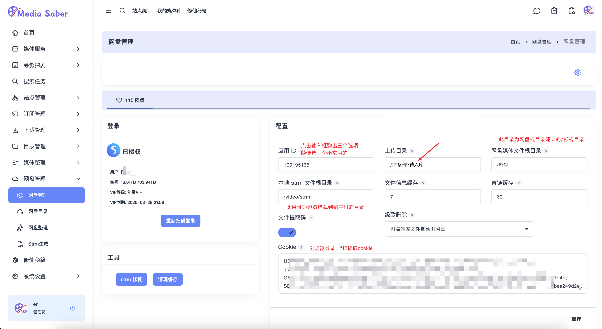
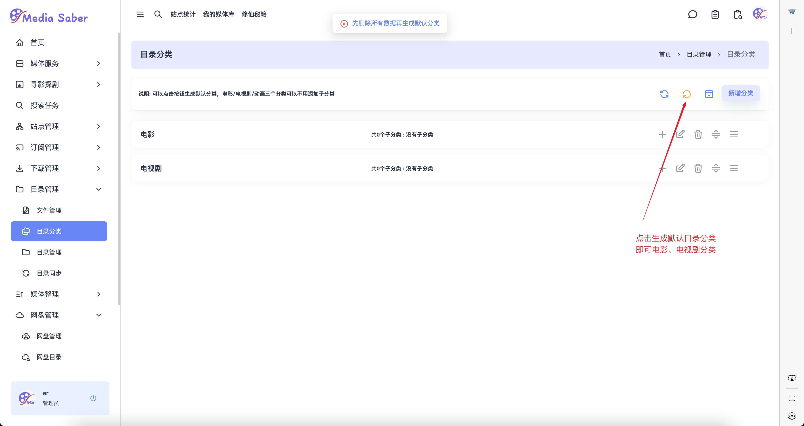
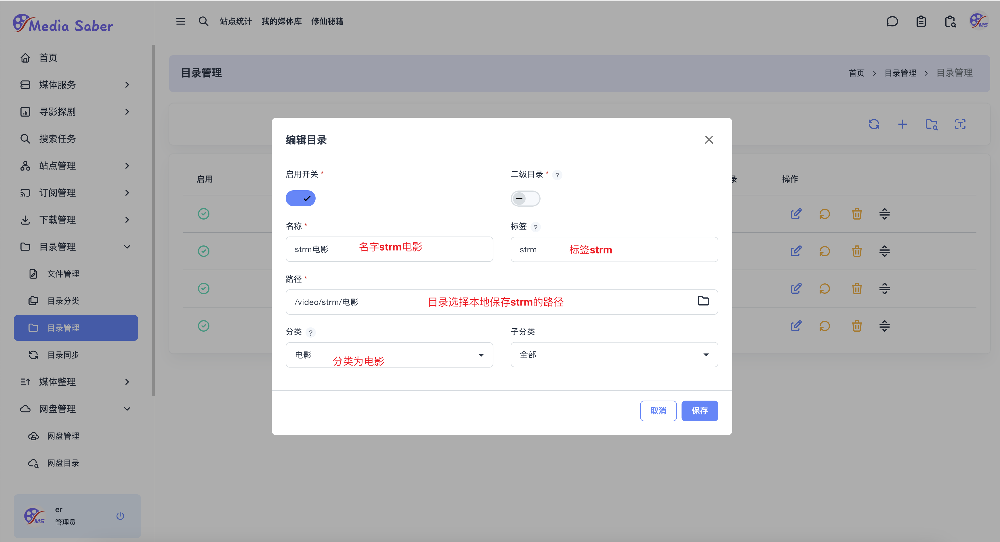
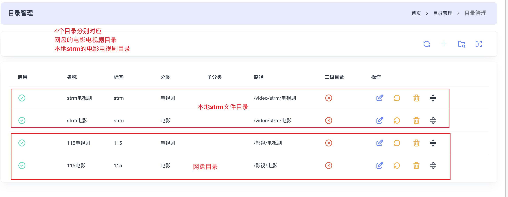
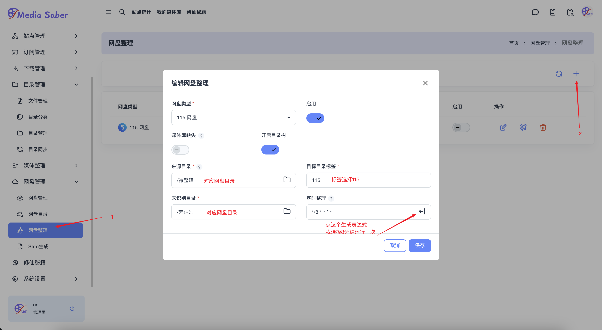
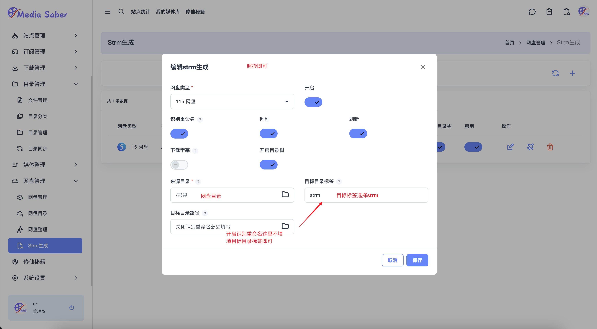
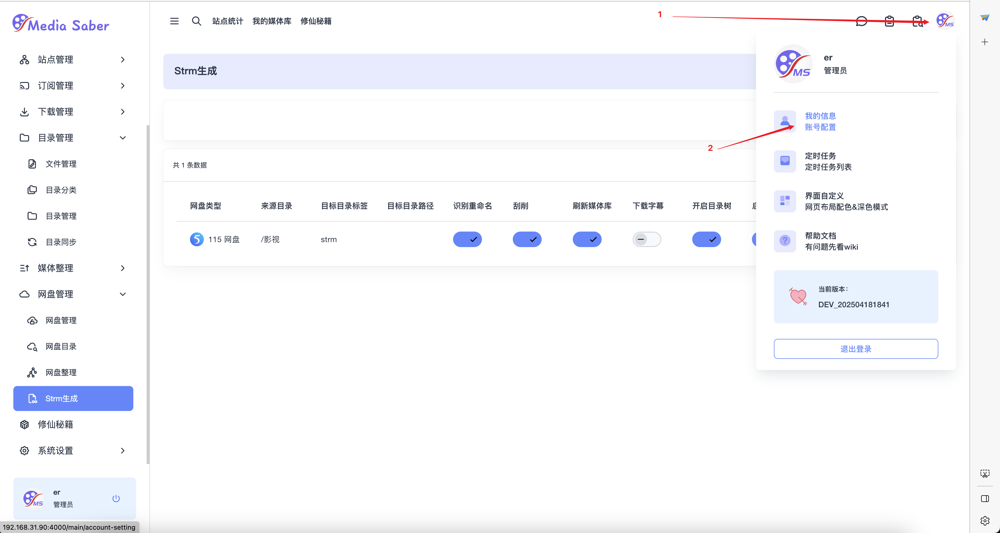
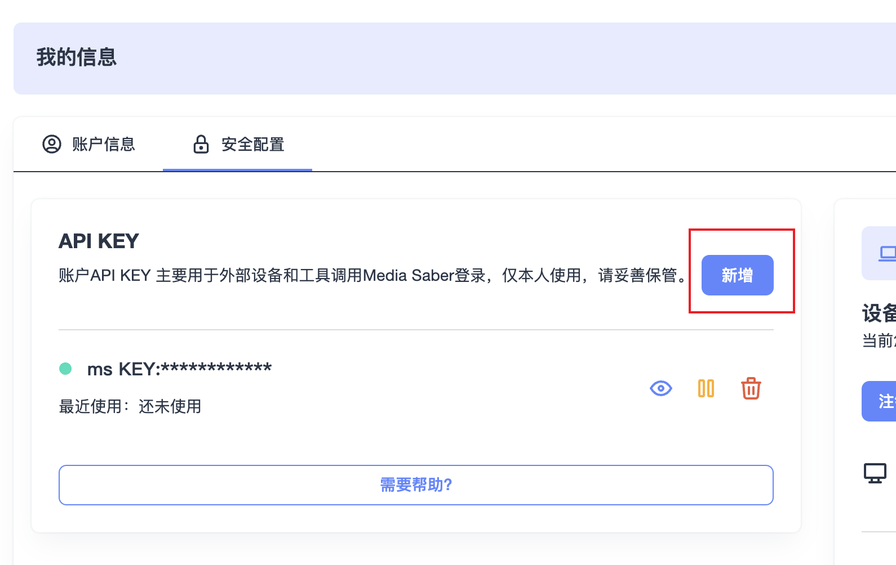
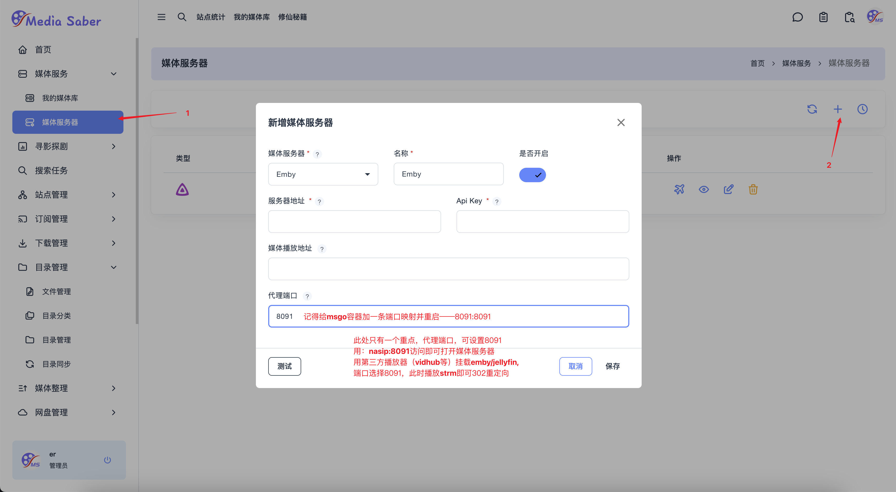
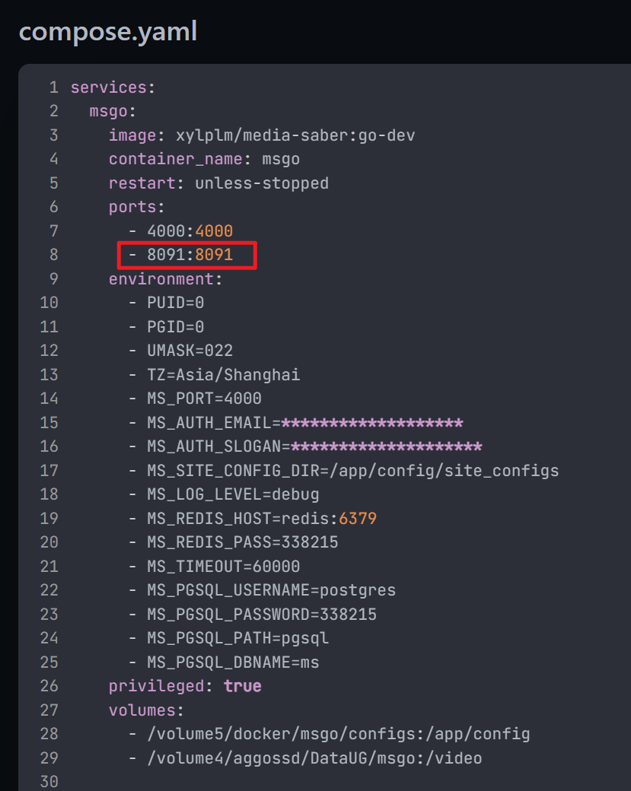

# 使用 msgo 全自动生成 115 网盘 strm 并刮削、反代 302 的完整教程

:::tip 提示

本教程适用于以下场景：

- 在网络上获取 115 网盘的分享链接，保存到自己网盘；
- 使用 msgo 自动整理资源、生成 `.strm` 文件；
- 完成媒体信息刮削及反向代理（302）。

:::

---

## 一、前提条件与网盘目录结构建议

#### 1. 适用场景说明

此流程主要服务于需要自动将 115 网盘资源通过 `.strm` 格式引入媒体管理系统的用户。

#### 2. 推荐目录结构

/
├── 影视
│   ├── 电影
│   └── 电视剧
├── 待整理
│   ├── 待入库
│   └── 未识别
```

## <span data-type="text" style="font-size: 16px;">3.自动化流程图</span>


## 二、登录网盘并配置初始目录

### 1. 登录 115 网盘

- 打开 msgo 网盘管理页面；
- 在“应用 ID”输入框中选择一个不常用的 115 账号用于登录；
- 设置上传目录为 `/待整理/待入库`，系统会自动处理该目录内的资源。

<div align="center"></div>

## 三、目录结构配置

### 1. 生成默认分类目录

<div align="center"></div>

### 2. 设置目录路径标签

- 115 网盘路径设置标签为 `115`
- 本地 `.strm` 文件路径设置标签为 `strm`

<div align="center"></div>

### 3. 电视剧路径设置（示例略）

<div align="center"></div>

### 4. 设置完成后目录效果

> 建议设置 4 个分类目录（容器路径 `/video` 映射至宿主机，用于存储 strm 文件）

<div align="center"></div>

---

## 四、配置网盘整理与 `.strm` 生成

### 1. 设置网盘整理规则

<div align="center"></div>

### 2. 配置 `.strm` 文件生成

<div align="center"></div>

---

## 五、完善系统设置

> 若生成 `.strm` 报错，请继续完成以下设置：

- 设置 msgo 的外网访问地址；
- 在右上角进入“个人中心”，配置 API Key。

<div align="center"></div>

<div align="center"></div>

完成后系统将根据设定规则自动生成 `.strm` 文件。

---

## 六、配置反向代理（302）

### 1. 设置媒体库服务器

<div align="center"></div>

### 2. 端口映射提醒

> 请务必将 `msgo` 的 8091 端口映射出来！

<div align="center"></div>