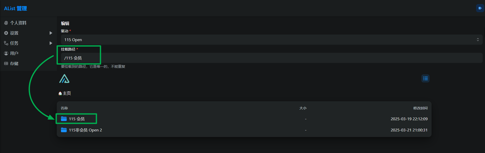
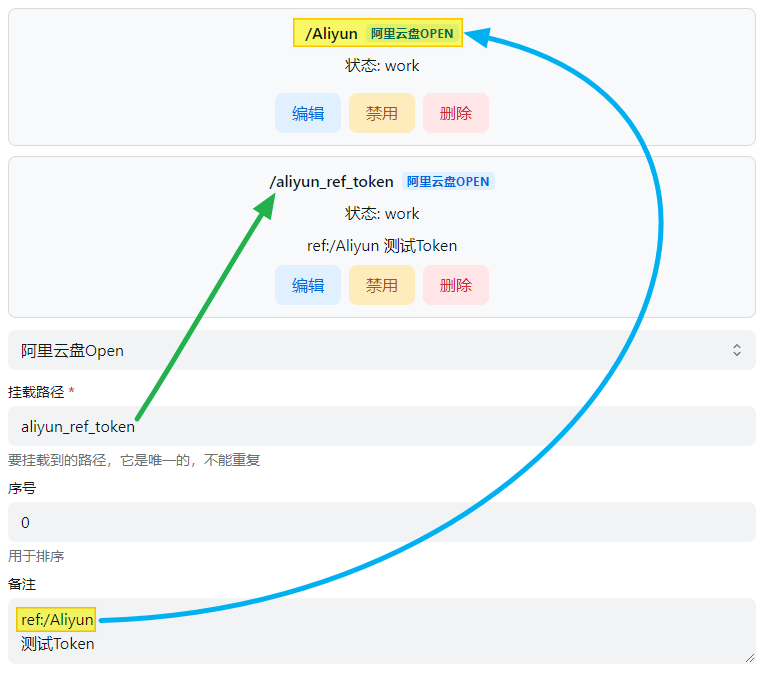

# 📦 网盘配置指南

Media Saber 支持多种网盘服务，通过 OpenList 驱动进行接入。本文档将详细介绍如何配置各种网盘服务。

## 支持的网盘类型

目前支持以下网盘类型：

- [115 网盘开放平台](#115-网盘开放平台)
- [115 网盘分享](#115-网盘分享)
- [123 云盘开放平台](#123-云盘开放平台)
- [中国移动云盘](#中国移动云盘)
- [天翼云盘](#天翼云盘)
- [阿里云盘（Oauth2）](#阿里云盘-oauth2)
- [百度网盘](#百度网盘)
- [OneDrive](#onedrive)
- [夸克网盘 Open](#夸克网盘-open)

## 通用配置参数

在配置任何网盘之前，需要了解一些通用配置参数：

### 挂载路径 (Mount Path)

挂载项的唯一标识，对外展示的名称，要挂载到的位置。如果要挂载到根目录，请填写 `/`。



> 注意：不能使用重复的挂载路径名称，否则会报错。

DANGER

不能使用重复的挂载路径名称，否则会报错：
```
Failed create storage in database: UNIQUE constraint failed: x_storages.mount_path
```

解决方法：使用别名对多个挂载项目进行聚合。

DANGER

挂载路径名称是必填项，不能为空，否则会报错：
```
Key: 'Storage.MountPath' Error:Field validation for 'MountPath' failed on the 'required' tag
```

解决方案：如果要挂载到根目录，请填写 /。

### 序号 (Order)

当挂载多个驱动时，用于排序。数字越小越靠前，可以填写负数。

### 备注 (Remark)

您可以添加备注，以方便管理。

#### 引用认证

从已挂载的存储中引用认证、令牌等，实现同一个 Token 多个网盘使用。

目前支持如下网盘：
- 中国移动云盘
- 阿里云盘（Oauth2）
- 天翼云盘客户端
- 123 云盘分享（引用123云盘）
- Cloudreve V3 / V4

使用方法：在存储设置中将备注(Remark)的第一行设置为：`ref:/挂载路径`

注意事项：ref:/ 为小写英文和符号



### 启用签名 (Enable signing)

对文件进行签名加密(不会需要密码)，仅对本驱动生效。

使用场景：不想开启全部签名，也不想设置元信息加密，只想对某驱动进行签名加密防止被扫。

影响范围：设置-->全局-->签名所有 > 元信息目录加密 > 单驱动签名

### 禁用索引 (Disable index)

允许用户禁用存储索引。

例如索引选项中的忽略索引，启用禁用索引后不需要再去配置了，这样也更方便一些。

### 缓存过期 (Cache Expiration)

目录结构的缓存时间。

### Web 代理 (Web proxy)

网页预览、下载和直接链接是否通过中转。如果打开此项，建议设置 site_url，以帮助 OpenList 更好的工作。

TIP

Web代理：是使用网页时候的策略，默认为本地代理，如果填写了代理URL并且启用了Web代理使用的是代理URL

WebDAV策略：是在使用WebDAV功能时候的选项，如果有302选项默认为302，如果没有302选项默认为本地代理，如果要使用代理URL请填写并且手动切换到代理URL策略

两者是不同的配置。

### WebDAV 策略 (Webdav policy)

WebDAV 功能的选项：
- 302 重定向：重定向到真实链接（虽然不会消耗流量，但是不建议共享使用，有封禁账户的风险）
- 使用代理 URL：重定向到代理 URL（会消耗搭建代理URL的流量）
- 本机代理：直接通过本地中转返回数据（最佳兼容性，会消耗搭建 OpenList 设备的流量）

## 各网盘详细配置指南

### 115 网盘开放平台

使用官方 115 开放平台 API 开发，请规范使用帐号，避免用于多人共享、图床、视频外链等不规范用途。

[查看官方文档](https://doc.oplist.org.cn/guide/drivers/115_open)

如果您对配置参数或获取方法不清楚，建议查看OpenList官方文档获取详细说明。

#### 获取刷新令牌

1. 访问令牌获取页面（如：https://alistgo.com/zh/tool/115/token）
2. 手机扫码后点击蓝色按钮即可获取 refresh token
3. 填写时只需要填写 refresh token，不需要填写 access token

#### 注意事项

如果不小心泄漏了 Token，可以前往 115 设备登录管理解除应用授权：
- 115 APP：【iOS 、Android】版本需要 ≥ 35.11.0
- 115 网页端：https://115.com/?mode=device_manage

#### 根文件夹 ID

默认根目录 ID 为：0

获取方式：
1. 打开 115 网盘官网
2. 点击进入要设置的文件夹
3. 查看 URL 中 cid 后面的数字

例如：https://115.com/?cid=249163533602609229&offset=0&tab=&mode=wangpan

这个文件夹的根文件夹 ID 即为 249163533602609229

### 115 网盘分享

115 分享链接存储驱动，用于挂载他人分享的 115 文件。

[查看官方文档](https://doc.oplist.org.cn/guide/drivers/115/)

如果您对配置参数不清楚，建议查看OpenList官方文档获取详细说明。

配置参数：
- 分享链接 ID：分享链接的唯一标识
- 分享密码：如果分享有密码保护，则需要填写密码

### 123 云盘开放平台

123 云盘开放平台 API 驱动。

[查看官方文档](https://doc.oplist.org.cn/guide/drivers/123_open/)

如果您对配置参数不清楚，建议查看OpenList官方文档获取详细说明。

配置参数：
- 用户名：123 云盘账号
- 密码：123 云盘密码
- 根文件夹 ID：默认为空，表示根目录

### 中国移动云盘

中国移动云盘（139 云盘）驱动，支持个人云和家庭云。

[查看官方文档](https://doc.oplist.org.cn/guide/drivers/139/)

如果您对配置参数不清楚，建议查看OpenList官方文档获取详细说明。

配置参数：
- 用户名：中国移动云盘账号（手机号）
- 密码：中国移动云盘密码
- 根文件夹 ID：默认为空，表示根目录

### 天翼云盘

天翼云盘驱动。

[查看官方文档](https://doc.oplist.org.cn/guide/drivers/189/)

如果您对配置参数不清楚，建议查看OpenList官方文档获取详细说明。

配置参数：
- 用户名：天翼云盘账号（手机号）
- 密码：天翼云盘密码
- 根文件夹 ID：默认为空，表示根目录

### 阿里云盘（Oauth2）

阿里云盘开放平台 API 驱动。

[查看官方文档](https://doc.oplist.org.cn/guide/drivers/aliyundrive_open/)

如果您对配置参数或获取方法不清楚，建议查看OpenList官方文档获取详细说明。

配置参数：
- Refresh Token：刷新令牌
- Root Folder ID：根文件夹 ID
- Order By：排序字段
- Order Direction：排序方向

获取 Refresh Token 的方法：
1. 登录阿里云盘官网
2. 打开浏览器开发者工具（F12）
3. 在 Console 中执行 JavaScript 代码获取 token

### 百度网盘

百度网盘驱动。

[查看官方文档](https://doc.oplist.org.cn/guide/drivers/baidu/)

如果您对配置参数或获取方法不清楚，建议查看OpenList官方文档获取详细说明。

配置参数：
- Access Token：访问令牌
- Refresh Token：刷新令牌
- 根文件夹 ID：默认为空，表示根目录

获取 Token 的方法：
1. 创建百度开发者应用
2. 获取授权码
3. 使用授权码换取 Access Token 和 Refresh Token

### OneDrive

微软 OneDrive 驱动。

[查看官方文档](https://doc.oplist.org.cn/guide/drivers/onedrive/)

如果您对配置参数或获取方法不清楚，建议查看OpenList官方文档获取详细说明。

配置参数：
- Region：区域（global/cn/de/us）
- Tenant ID：租户 ID
- Client ID：客户端 ID
- Client Secret：客户端密钥
- Refresh Token：刷新令牌
- Root Folder Path：根文件夹路径
- Internal Upload：是否启用内部上传

获取配置参数的方法：
1. 注册 Azure 应用
2. 配置 API 权限
3. 获取客户端凭据
4. 获取用户授权并获取刷新令牌

### 夸克网盘 Open

夸克网盘开放平台 API 驱动。

[查看官方文档](https://doc.oplist.org.cn/guide/drivers/quark/)

如果您对配置参数或获取方法不清楚，建议查看OpenList官方文档获取详细说明。

配置参数：
- Cookie：夸克网盘的 Cookie 信息
- 根文件夹 ID：默认为空，表示根目录

获取 Cookie 的方法：
1. 登录夸克网盘网页版
2. 打开浏览器开发者工具
3. 在 Network 标签中找到请求头中的 Cookie 信息