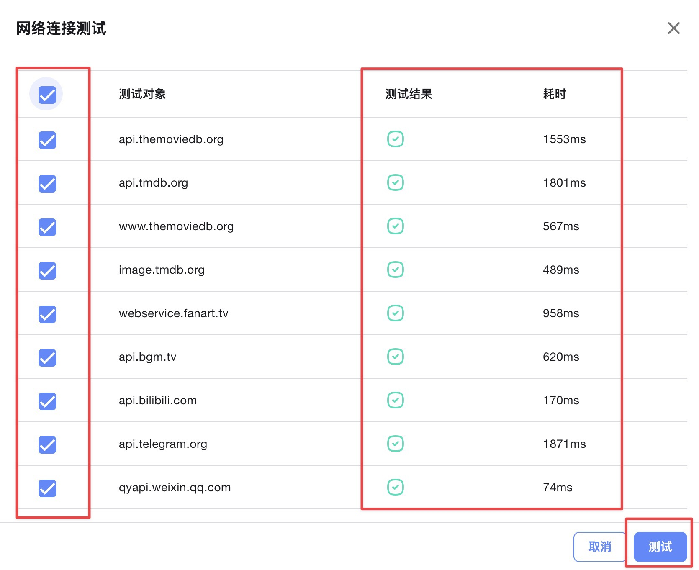

:::note 致谢
感谢`@XXX` 大佬 为大家带来本篇的教程。
:::
## 修仙秘籍

---

### 一、安装与卸载

点击左侧菜单 **“修仙秘籍”** 进入插件模块：

- **“修仙秘籍”** 页面：显示已安装的插件  
- **“秘术宝阁”** 页面：插件市场，可安装和卸载插件

点击“秘术宝阁”进入插件市场页面，在此处可通过切换 **“启灵”** 状态来完成插件的下载或卸载。

---

### 二、插件介绍与使用

---

#### 1. 网络 Ping

**插件说明：**  
测试 TMDB、Fanart、Telegram、WeiXin、OpenSubtitles 等系统服务的网络连接性。

**插件使用：**  
在“修仙秘籍”中打开【网络 Ping】，配置方式如下图所示：

---

#### 2. DC 助手

**插件说明：**  
需同时安装并部署 [dockerCopilot 项目](https://github.com/onlyLTY/dockerCopilot)（感谢唯依大佬），该插件可实现：

- Docker 镜像更新通知  
- 自动更新  
- 自动备份  
- 镜像清理功能  

⚠️ 请注意系统版本兼容性。

**插件使用：**  
在“修仙秘籍”中打开【DC 助手】，配置方式如下图所示：

---

#### 3. 追剧提醒

**插件说明：**  
每天推送你订阅剧集的更新内容。

**插件使用：**  
在“修仙秘籍”中打开【追剧提醒】，配置方式如下图所示：

