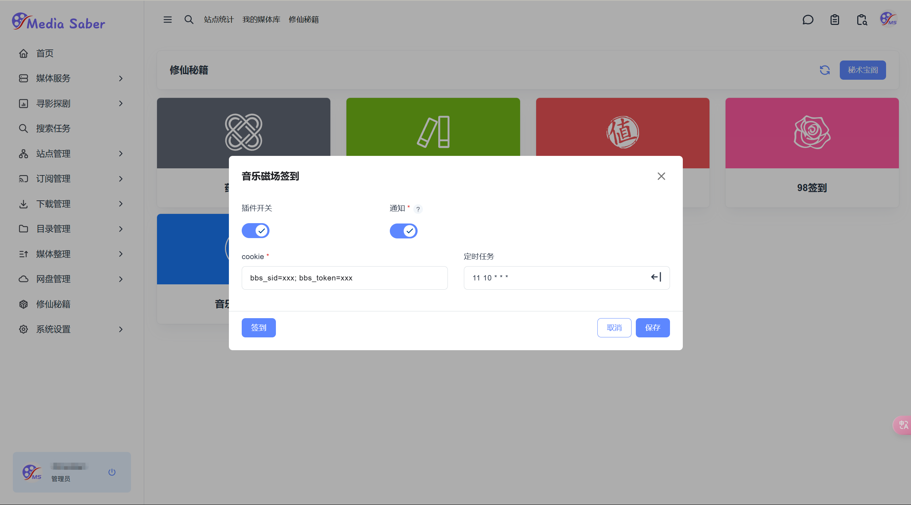

---
title: 音乐磁场签到插件使用指南
article: false
date: 2025-04-25T00:00:00.000Z
tags:
categories: 
  - 插件教程
  - 功能配置
editor: markdown
dateCreated: 2025-04-25T00:00:00.000Z
permalink: /guide/plugin/music-signin
---

### 一、插件概述

“音乐磁场签到”是 MR 系统中的一款插件，用于实现**音乐磁场自动签到**功能。为确保流程顺利，请严格按照以下步骤完成配置。

---

### 二、使用步骤

#### 1.进入签到界面

路径：**修仙秘籍 → 插件管理 → 安装并启动“音乐磁场签到”插件**

<div align="center"></div>  

---

#### 2.开启功能开关

- **插件开关**：启用后激活签到功能  
- **通知开关**：启用后接收签到结果通知  

> 启用通知开关前，请先配置好通知渠道，并勾选对应插件消息的通知选项。

---

#### 3.填写基础信息

- **Cookie**：粘贴从音乐磁场网页获取的完整 Cookie 信息：

```plaintext
bbs_sid=xxx; bbs_token=xxx
```

> Cookie 信息必须完整且有效，否则签到可能失败或无法获取奖励。

---

#### 4.设置定时任务

- **方式一**：手动输入 cron 表达式（格式：秒 分 时 日 月 周）  
  例如：`0 11 * * * ?` 表示每天 11 点执行  

- **方式二**：使用插件内置的 cron 生成器简化配置

---

#### 5.保存配置

点击“保存”按钮，弹出提示：

> 签到配置保存成功

---

#### 6.手动触发签到

点击“立即签到”按钮，可手动执行一次签到操作。

---

### 三、注意事项

> **Cookie 有效期**
> - `bbs_sid` 和 `bbs_token` 必须从网页版音乐磁场获取
> - Cookie 可能因登录过期或异地登录失效，需定期更新

> **Cron 表达式格式**
> - 格式为：秒 分 时 日 月 周
> - 建议使用生成器，避免格式错误
> - 取值范围：
>   - 秒：0 - 59
>   - 分：0 - 59
>   - 时：0 - 23
>   - 日：1 - 31
>   - 月：1 - 12
>   - 周：0 - 6（0 和 7 均代表周日）

> **签到时间限制**
> - 签到需在平台有效时间段内执行  
> - 若失败，请检查网络后重试

> **签到频率限制**
> - 建议每日仅设置一次定时任务  
> - 频繁签到可能触发平台风控机制

---

### 四、示例配置图

<div align="center"></div>  
<div align="center">图示包含 Cookie 填写示例及开关状态</div>

---

配置完成后，插件将自动执行签到任务。如遇问题，请检查网络连接及 Cookie 有效性后重试。

---

<div align="center">
  <span style="font-size: 16px;">🎉 本篇 Wiki 由热心大佬 <span style="color: #2196f3; font-weight: bold;">Estara</span> 提供支持与贡献，感谢他的无私分享与帮助！</span>
</div>

---
