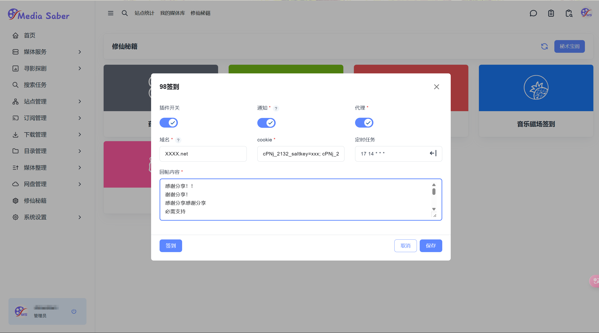

### 一、插件概述

“98签到”是 MR 系统中的一款插件，用于实现**98论坛的自动签到与回帖**功能。为确保流程顺利，请严格按照以下步骤完成配置。

---

### 二、使用步骤

#### 1.进入签到界面

路径：**修仙秘籍 → 插件管理 → 安装并启动“98签到”插件**

<div align="center"></div>  

---

#### 2.开启功能开关

- **插件开关**：启用后激活签到功能  
- **代理开关**：如目标域名需代理访问，启用此选项（需提前配置代理）  
- **通知开关**：启用后接收签到结果通知  

> 启用通知前，请先完成通知渠道配置并勾选对应插件的通知消息选项。

---

#### 3.填写基础信息

- **域名**：输入目标论坛的完整域名（如 `example.net`）  
  > 如为免翻地址，无需开启代理；若为需翻墙地址，请确保代理配置完整并开启代理。

- **Cookie**：粘贴从 98 论坛获取的完整 Cookie 信息：

```plaintext
cPNj_2132_saltkey=xxx; cPNj_2132_auth=xxx; cPNj_2132_sid=xxx; ...
```

- **回帖内容**：每行填写一条回复内容（至少一条），例如：

```plaintext
每日打卡，感谢分享！
支持论坛，持续关注！
```

> 内容需真实有意义，避免灌水以免账号受限。

---

#### 4.设置定时任务

- **方式一**：手动输入 cron 表达式（格式：秒 分 时 日 月 周）  
  示例：`0 9 * * * ?` 表示每天 9 点执行

- **方式二**：使用插件内置的 cron 生成器简化配置

---

#### 5.保存配置

点击“保存”按钮，弹出提示：

> 签到配置保存成功

---

#### 6.手动触发签到

点击“立即签到”按钮，可立即执行一次签到与回帖操作。

---

### 三、注意事项

> **域名与代理**
> - 免翻域名请填写完整（不含 https://）
> - 需代理的地址请确保已配置代理并开启代理开关

> **回帖内容要求**
> - 必须填写有效内容，至少一条
> - 禁止灌水内容（如“111”、“666”），避免账号受限

> **Cookie 有效期**
> - 登录信息可能过期，建议定期更新

> **签到频率限制**
> - 建议每日仅设置一次，避免频繁操作触发风控

> **Cron 表达式格式**
> - 格式为：秒 分 时 日 月 周
> - 建议使用生成器避免配置错误

---

### 四、示例配置图

<div align="center"></div>  
<div align="center">图示包含域名、Cookie、回帖内容填写示例及开关状态</div>

---

配置完成后，插件将自动执行签到与回帖任务。如遇问题，请检查网络、Cookie 或代理设置后重试。
---

<div align="center">
  <span style="font-size: 16px;">🎉 本篇 Wiki 由热心大佬 <span style="color: #2196f3; font-weight: bold;">Estara</span> 提供支持与贡献，感谢他的无私分享与帮助！</span>
</div>

---