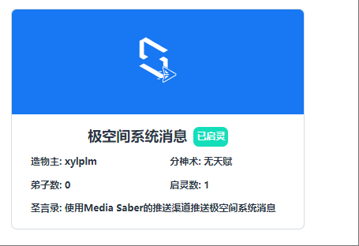
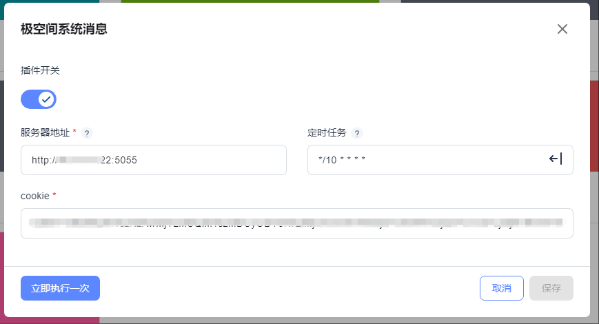

## 插件说明
可以通过此插件实现利用MS的推送渠道推送极空间系统消息，比如极空间的更新通知，知道何时更新成功,得到异常消息等。

## 插件使用
1、修仙秘籍打开【极空间系统消息】

服务器地址：填入极空间的IP地址，注意是IP地址！一般极空间端口是5055，例如完整的http://192.168.2.188:5055

定时任务：可以使用GO版本中自带的生成cron表达式，也可以手动填写，如0 9 * * *（每天9点运行）  */10 * * * *（每10分钟查询一次）

Cookie：可使用浏览器访问极空间获取Cookie，或者使用客户端获取。

极空间Cookie获取方法可以前往 【使用文档-> 其他 -> 极空间获取Cookie】查看 [【点击前往极空间获取Cookie】](/docs/other/zspace_cookie/)

将获取到的cookie填入即可

2、第一次运行ms配置的推送渠道和APP会最近10条的极空间系统消息，以后就只会获取最新消息。