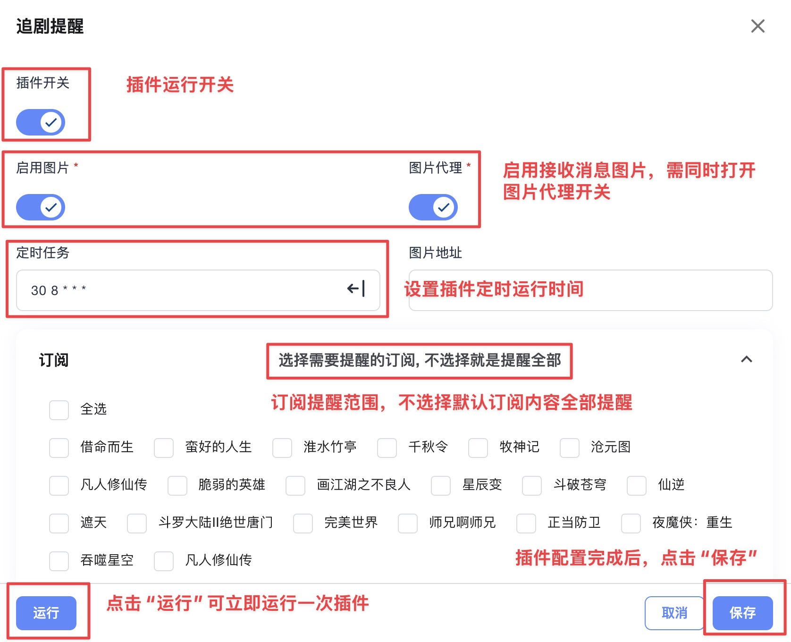

### 追剧提醒插件

追剧提醒插件可以自动监控您订阅的电视剧更新情况，并及时推送更新通知，让您不错过任何精彩内容。

#### 插件功能

- **自动监控**：定时检查订阅剧集的更新状态
- **智能提醒**：新集更新时自动发送通知
- **图片支持**：可在通知中包含剧集海报图片
- **灵活订阅**：支持选择特定订阅或监控全部订阅

#### 配置选项

##### 基础设置

- **插件开关**：启用或禁用追剧提醒功能
- **定时任务**：设置检查更新的时间间隔
  > 📖 **Cron表达式**：详细语法请参考 [Cron表达式说明文档](/docs/other/cron_rule)

##### 图片设置

- **启用图片**：在通知中显示剧集海报图片
- **图片代理**：使用代理服务加载图片（适用于网络受限环境）
- **图片地址**：自定义图片链接地址

##### 订阅选择

- **订阅列表**：选择需要提醒的特定订阅
- **全部监控**：留空则监控所有已启用的订阅

#### 使用方法

1. **启用插件**：
   - 打开插件开关
   - 设置合适的检查频率

2. **配置图片**：
   - 根据需要启用图片功能
   - 网络环境不佳时可启用图片代理

3. **选择订阅**：
   - 在订阅列表中勾选需要提醒的剧集
   - 不选择任何订阅则默认监控全部

4. **手动执行**：
   - 点击"运行"按钮可立即执行一次检查
   - 用于测试配置是否正确

#### 通知内容

追剧提醒会发送包含以下信息的通知：
- 剧集名称和季数
- 新更新的集数信息
- 更新时间
- 剧集海报图片（如启用）

#### 注意事项

- 建议设置合理的检查频率，避免过于频繁的请求
- 图片代理功能适用于无法直接访问图片源的环境
- 确保订阅源正常运行，否则可能影响检查结果
- 通知渠道需要预先配置在系统设置中

#### 常见问题

**Q: 为什么没有收到更新通知？**
A: 检查插件是否启用、订阅是否正常、通知渠道是否配置正确。

**Q: 图片无法显示怎么办？**
A: 可以尝试启用图片代理功能，或检查网络连接。

**Q: 如何调整检查频率？**
A: 在定时任务中修改Cron表达式，建议不要设置过于频繁。

---
