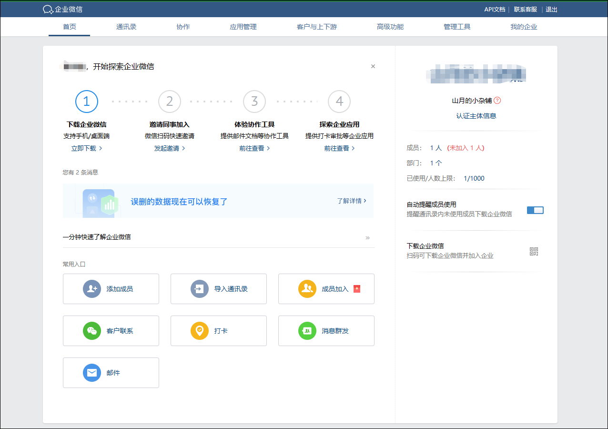

## 微信通知

1、注册登录企业微信网页，并下载企业微信手机客户端

企业微信网页：https://work.weixin.qq.com/

2、注册一个企业，进入企业微信网页管理页面，进行配置


3、进入管理后台



4、点击右上角我的企业，在页面最下方获取企业id


5、打开“应用管理”然后在自建中点击创建应用


6、填写必要信息，创建应用。


7、获取企业微信信息和应用信息

1）在应用管理界面可以直接看到`AgentId`


2）点击`Secret`的查看，即可在手机端企业微信获取到`Secret`


4）点击设置 API 接收


5）填写URL
`https://ip:port/api/v1/webhook/wechat/AgentId?apiKey=用户密钥`
```
# ip:你的域名
# port:你的反代端口
# AgentId:你的企业微信应用AgentId
#用户密钥：Media Saber内右上角 我的信息-安全配置-API KEY
```
比如我的填写后示例：
`http://demo.mediasaber.XXX:5858/api/v1/webhook/wechat/1000002?apiKey=sk-0c97c5856756756736778274`

6）随机获取`Token`和`EncodingAESKey`

不要点击保存

8、在media-saber的系统设置——消息通知界面，点击添加渠道


在弹出框中填入获取到 5 个信息（`企业微信ID`、`AgentId`、`Secret`、`Token`、`EncodingAESKey`），填入微信代理：`http://ip:port`在 ms 配置界面填好以后，勾选`是否交互`，在下方推送业务类型中勾选需要推送的业务，点击确定，保存好。（`ps：推荐全选所有推送业务`）


8、然后我们再回到刚刚的企业微信的 API 接收配置页面，点击保存，会出现保存成功的提示，此时我们 API 接收变成已启用状态。


9、点击返回，下滑，找到企业可信 IP 点击编辑，在弹出对话框中填入微信代理ip后点击确定即可。


> 在企业微信控制台`我的企业->微信插件`找到邀请关注二维码，使用微信扫码后可直接在微信使用，无需打开企业微信客户端。

## 微信交互菜单配置

1、media-saber页面点击`设置——消息通知`，点击刚刚创建的`微信通知`，点击`生成菜单`。


## 微信代理参考

- [搭建微信转发代理.pdf](/files/搭建微信转发代理_.pdf)
- [自己搭建 vps 转发企业微信通知.pdf](/files/自己搭建vps转发企业微信通知.pdf)
- [微信通知搭建 caddy 代理超简单流程.pdf](/files/微信通知搭建caddy代理超简单流程.pdf)
