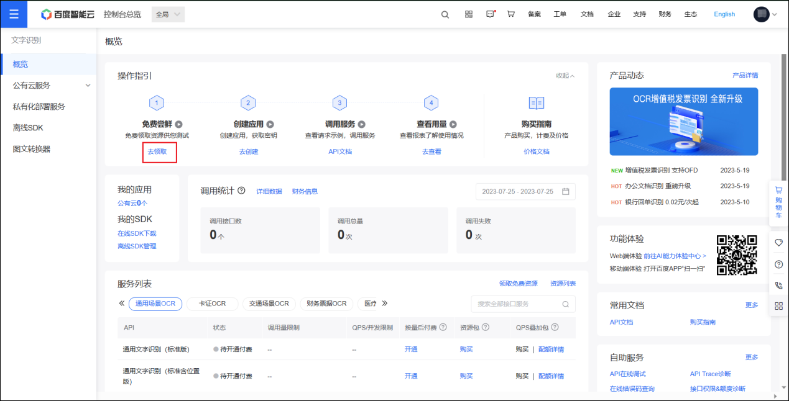
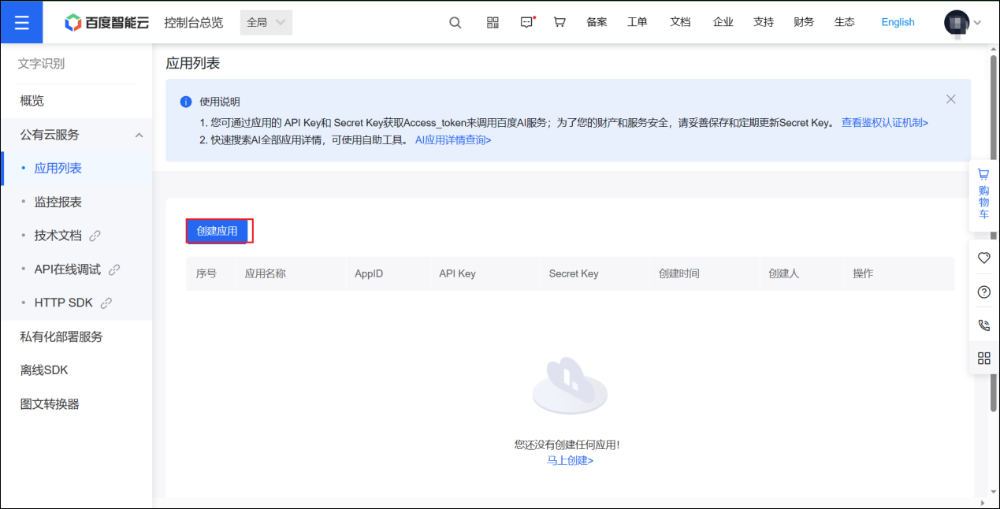
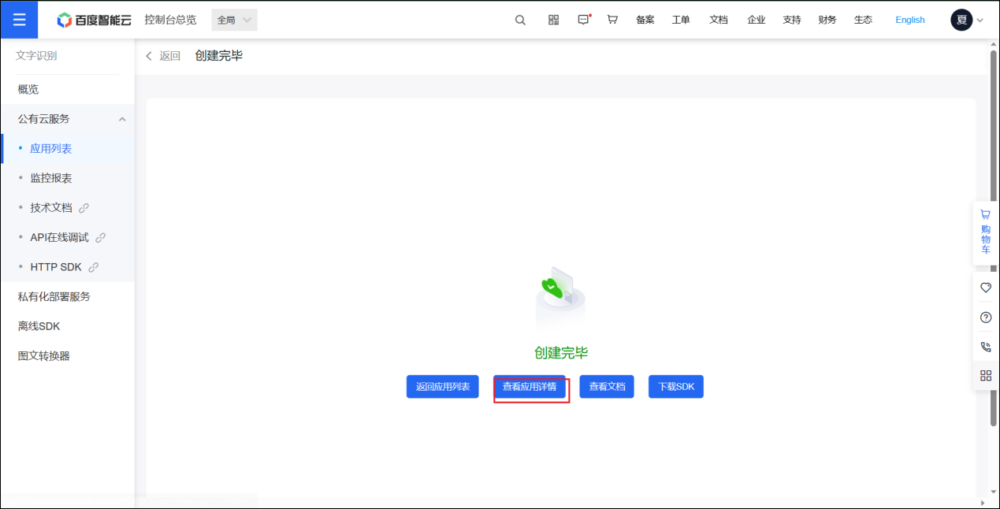
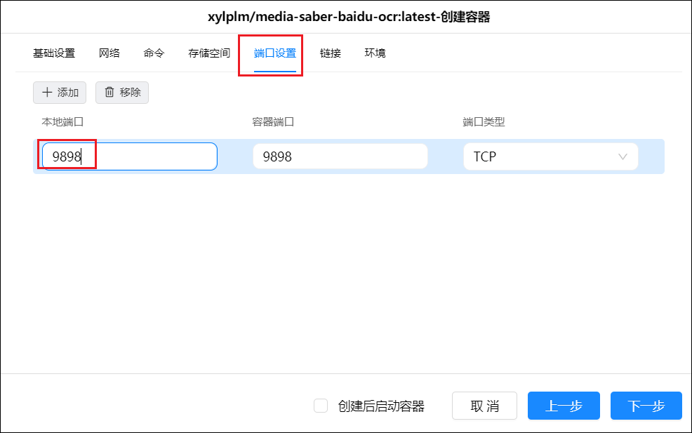

# 🔤 OCR服务配置指南

> OCR 服务主要用于网站登录更新 cookie 以及特殊站点签到等识别验证码场景。Media Saber 不提供任何 OCR 服务，请自行搭建或使用第三方服务。

---

## 📋 配置概览

在 [基础设置](/docs/system_settings/basic_settings/#_7%EF%B8%8F%E2%83%A3-%E6%9C%8D%E5%8A%A1%E9%85%8D%E7%BD%AE) 的"服务配置"部分，找到"OCR服务地址"进行配置：

**支持的服务类型：**
- 🌐 **第三方服务**：免费，依赖外部稳定性
- 🐳 **自建 Paddle OCR**：高识别率，本地部署（不支持ARM）
- 🔍 **自建 Baidu OCR**：API调用，支持所有架构

配置完成后请点击"测试"按钮验证服务有效性。

---

## 🌐 第三方 OCR 服务

### Movie Pilot服务（推荐）

本项目支持NT和Movie Pilot OCR服务格式。

```
https://movie-pilot.org/captcha/base64
```

**特点：**
- ✅ 免费使用，识别率高
- ✅ 无需配置，即用即可
- ⚠️ 依赖外部服务稳定性

> **注意：** 原地址 `https://nastool.cn/captcha/base64` 已作废

### DDSDerek OCR 服务（推荐）

热心网友 DDSDerek 大佬搭建的备用服务。

```
https://ocr.ddsrem.com/captcha/base64
```

**特点：**
- ✅ 免费使用，可作备用
- ⚠️ 速度相对较慢
- ⚠️ 网络条件影响较大

---

## 🐳 自建 Paddle OCR 服务

### 服务特点

- ✅ **高识别率**：基于 PaddleOCR 引擎，准确率高
- ✅ **本地部署**：数据不出本地，安全可控
- ✅ **免费使用**：无API调用费用
- ⚠️ **资源消耗大**：需要较多CPU/内存资源
- ❌ **不支持ARM**：仅支持 x86_64 架构

### Docker 部署

**镜像地址：**
```
https://hub.docker.com/r/xylplm/media-saber-paddle-ocr
```

**部署命令：**
```bash
docker run -d \
  --name media-saber-paddle-ocr \
  -p 9899:9899 \
  --restart=unless-stopped \
  xylplm/media-saber-paddle-ocr
```

**服务地址配置：**
```
http://127.0.0.1:9899/captcha/base64
```

> **重要提醒：** ARM 架构（如树莓派、某些NAS）不支持此镜像，请使用百度OCR服务。

---

## 🔍 自建 Baidu OCR 服务（推荐）

### 前期准备：申请百度 OCR API

#### 步骤 1：注册百度智能云

访问 `https://cloud.baidu.com/` 注册登录百度智能云账号。

#### 步骤 2：开通文字识别服务

选择产品-文字识别-文字识别


点击立即使用


点击去领取



#### 步骤 3：领取免费额度

进入领取页面后，选择通用场景 OCR，待领接口选择全部，点击下方的 0 元领取。


跳出领取成功界面，点击前往应用列表


#### 步骤 4：创建应用

点击创建应用



创建应用界面处的配置：
- **应用名称**：自定义名称即可
- **接口选择**：文字识别选择全部


往下滑：
- **应用归属**：选择个人
- **应用描述**：随便填写

然后点击立即创建。


来到创建完毕界面，选择查看应用详情



#### 步骤 5：获取 API 信息

获得需要的三个数据：`OCR_APP_ID`、`OCR_API_KEY`、`OCR_SECRET_KEY`，稍后填入环境变量。


### Docker 部署

**镜像地址：**
```
https://hub.docker.com/r/xylplm/media-saber-baidu-ocr
```

#### 命令行部署

```bash
docker run -d \
  --name media-saber-baidu-ocr \
  -p 9898:9898 \
  -e OCR_APP_ID=your_app_id \
  -e OCR_API_KEY=your_api_key \
  -e OCR_SECRET_KEY=your_secret_key \
  --restart=unless-stopped \
  xylplm/media-saber-baidu-ocr
```

#### Docker Compose 部署

```yaml
version: '3.8'
services:
  baidu-ocr:
    image: xylplm/media-saber-baidu-ocr
    container_name: media-saber-baidu-ocr
    ports:
      - "9898:9898"
    environment:
      - OCR_APP_ID=替换为你的APP_ID
      - OCR_API_KEY=替换为你的API_KEY
      - OCR_SECRET_KEY=替换为你的SECRET_KEY
    restart: unless-stopped
```

#### 可视化界面部署（以绿联为例）

**1. 下载镜像**

在镜像仓库搜索并下载 `media-saber-baidu-ocr` 镜像。


**2. 创建容器**

基础设置中重启策略选择"退出时重启"。


本地端口填写 9898（如果未被占用）。



环境变量填写刚刚获取的三个值，然后点击下一步完成容器创建。


### 配置 Media Saber

在 [基础设置](/docs/system_settings/basic_settings/#ocr%E6%9C%8D%E5%8A%A1%E5%9C%B0%E5%9D%80) 的OCR服务地址中填写：

```
http://127.0.0.1:9898/captcha/base64
```

> 注意：将 `127.0.0.1` 替换为你的实际 IP 地址


保存配置后（**先保存！**）点击测试按钮。


测试成功即表示配置完成。

---

## 🔧 故障排除

### 常见问题解决

| 问题 | 可能原因 | 解决方案 |
|------|----------|----------|
| 测试失败 | 服务地址错误 | 检查地址格式和IP |
| 连接超时 | 网络问题 | 检查防火墙和端口 |
| 百度OCR报错 | API配置错误 | 验证三个环境变量 |
| ARM设备无法使用Paddle | 架构不支持 | 改用百度OCR服务 |

### 服务选择建议

| 使用场景 | 推荐方案 | 说明 |
|----------|----------|------|
| 轻度使用 | NT原作者服务 | 免费，无需配置 |
| 重度使用 | 自建Paddle OCR | 高精度，本地部署 |
| ARM设备 | 自建百度OCR | 支持所有架构 |
| 网络受限 | 百度OCR | API调用，稳定性好 |

### 性能优化提示

- **Paddle OCR**：建议分配 2GB+ 内存，CPU 2核+
- **百度OCR**：注意API调用次数限制，可升级套餐
- **网络优化**：使用国内镜像加速下载

---

## 📖 相关文档

- [基础设置](/docs/system_settings/basic_settings/) - 系统基础配置
- [站点管理](/docs/site_management/) - 站点维护和管理  
- [系统设置](/docs/system_settings/) - 更多系统配置选项

---