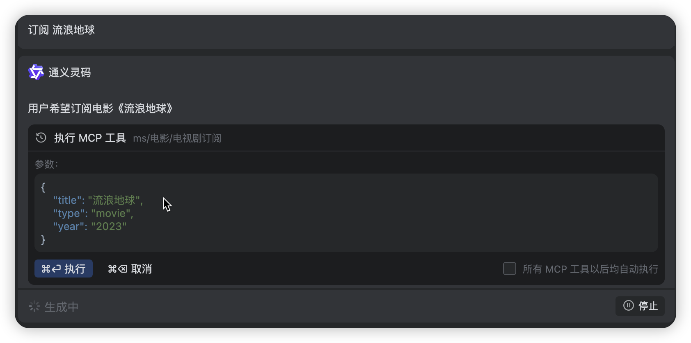
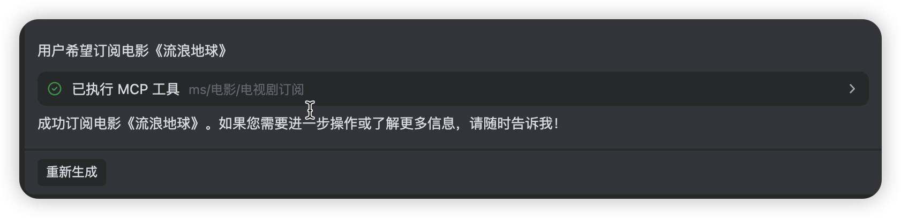

# Media Saber-MCP 简介

> 一个基于 MCP（Model Context Protocol）的本地电影 / 电视剧订阅服务，让订阅像聊天一样简单。

---

## 1. 项目定位
Media Saber-MCP 把「我想看」变成「已订阅」——  只需一句话，系统就能帮你追踪影片更新、自动入库，并实时推送状态。  
它完全跑在本地，无需注册、无需云同步，隐私可控，速度飞快。

---

## 2. 功能一览
| 功能 | 说明 | 示例 |
|---|---|---|
| 自然语言订阅 | 解析影片名、年份、季数 | `订阅 复仇者联盟 2012` |
| 多类型支持 | 电影 / 电视剧 / 动漫 | `订阅 权力的游戏 S01` |
| 本地服务 | 零配置局域网访问 | `http://IP:22699/sse` |

---

## 3. 快速上手

### 3.1 启动服务
```bash
# 在Media Saber Docker 环境添加
MS_MCP_SERVER_ENABLE=true
MS_MCP_SERVER_BASE_URL=http://IP:22699
```

### 3.2 用任意 MCP 客户端订阅

在可以使用的客户端中添加 MCP 服务，选择手动添加，填入 MCP 服务的 URL 即可。（如下图）


以下是效果示例：




---

## 4. 常见问题

Q: 为啥我的 MCP 服务无法使用？ 发送 订阅 xxx 直接给我回复解释？  
A: 那你可以换个客户端，在重新添加 MCP 服务。

Q: 支持哪些话语？  
A: 订阅+名字 / 订阅+名字+年份 / 订阅+名字+季数 / 订阅+名字+季数+年份

---

## 5. 开发 & 贡献
- 作者: 强大的`J佬`

---