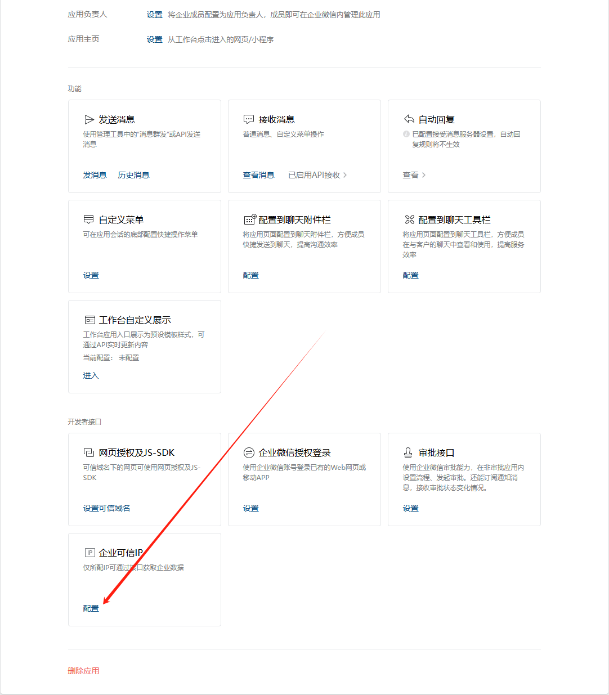
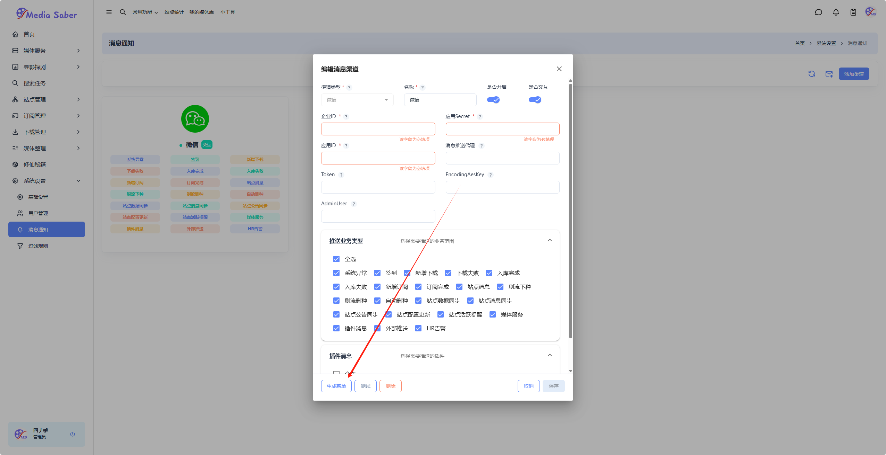

# 📱 微信消息通知

微信消息通知功能允许用户通过企业微信接收系统通知，并支持远程交互控制。本文档详细介绍如何配置企业微信作为消息通知渠道。

> 配置前请确保已在 [消息通知](/docs/system_settings/message_notifications/) 页面了解基本配置流程

## 📋 配置流程概览

1. 注册并登录企业微信
2. 创建企业并获取企业ID
3. 创建应用并获取应用信息
4. 配置API接收
5. 在Media Saber中配置微信渠道
6. 配置企业可信IP
7. （可选）生成微信交互菜单

## 🏢 企业微信配置

### 1. 注册企业微信

访问企业微信官网注册并登录：
https://work.weixin.qq.com/

### 2. 获取企业ID

进入管理后台后，点击右上角"我的企业"，在页面最下方获取企业ID：


### 3. 创建应用

打开"应用管理"，在自建应用中点击"创建应用"：


填写必要信息创建应用：


### 4. 获取应用信息

在应用管理界面可以获取到以下信息：

1. **AgentId**：应用ID
   

2. **Secret**：点击"Secret"的查看按钮，在手机端企业微信获取
   

## 🔧 API接收配置

### 1. 设置API接收

点击应用设置中的"API接收"：


### 2. 填写URL

URL格式如下：
```
https://ip:port/api/v1/webhook/wechat/AgentId?apiKey=用户密钥
```

参数说明：
- `ip`: 你的域名或公网IP
- `port`: 你的反向代理端口
- `AgentId`: 你的企业微信应用AgentId
- `用户密钥`: Media Saber内右上角 我的信息-安全配置-API KEY

示例：
```
http://demo.mediasaber.example:5858/api/v1/webhook/wechat/1000002?apiKey=sk-0c97c5856756756736778274
```

### 3. 配置Token和EncodingAESKey

随机生成Token和EncodingAESKey（不要点击保存）。

## ⚙️ Media Saber配置

### 1. 添加微信渠道

进入`系统设置` → `消息通知`页面，点击"添加渠道"：


### 2. 填写配置信息

在弹出框中填入以下5个信息：
- 企业微信ID（CorpID）
- AgentId
- Secret
- Token
- EncodingAESKey

同时配置微信代理地址：`http://ip:port`

勾选`是否交互`，在下方推送业务类型中勾选需要推送的业务，推荐全选所有推送业务：


## 🔒 安全配置

### 1. 保存API接收配置

回到企业微信的API接收配置页面，点击保存，会出现保存成功的提示，此时API接收变成已启用状态：


### 2. 配置企业可信IP

点击返回，下滑找到"企业可信IP"并点击编辑，在弹出对话框中填入微信代理IP后点击确定：




> 在企业微信控制台`我的企业->微信插件`找到邀请关注二维码，使用微信扫码后可直接在微信使用，无需打开企业微信客户端。

## 📋 微信交互菜单配置

进入`设置` → `消息通知`，点击已创建的微信通知渠道，点击`生成菜单`按钮：



## 🌐 微信代理参考

如果需要搭建微信转发代理，可以参考以下文档：

- [搭建微信转发代理.pdf](/files/搭建微信转发代理_.pdf)
- [自己搭建 vps 转发企业微信通知.pdf](/files/自己搭建vps转发企业微信通知.pdf)
- [微信通知搭建 caddy 代理超简单流程.pdf](/files/微信通知搭建caddy代理超简单流程.pdf)

## ⚠️ 注意事项

1. 确保微信代理地址公网可访问
2. 正确配置企业可信IP以保证消息推送正常
3. API Key需要在Media Saber的安全配置中获取
4. 建议开启所有推送业务类型以获得完整通知体验
5. 配置完成后使用测试功能验证配置正确性