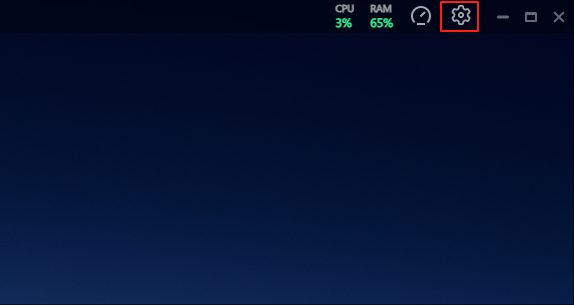

# 🍪 极空间获取Cookie

在配置[媒体服务](/docs/server/zspace/)或[系统消息通知](/docs/cultivation_secrets/zspace_system_messages/)时，如果需要使用极空间相关功能，您需要获取极空间Cookie信息用于身份验证。

## 📌 文档说明

本文档介绍如何获取极空间NAS系统的Cookie信息，该信息用于在Media Saber中配置极空间相关功能（如极影视媒体库、极空间系统消息推送等）。

> ⚠️ **重要提示**：
> - 获取Cookie需要极空间账号的管理权限
> - 获取过程不会影响极空间系统安全
> - Cookie信息仅用于Media Saber本地使用
> - 建议在熟悉操作的环境下进行

## 🔧 获取步骤

### 方法一：控制台快速获取（推荐）

1. 打开极空间PC客户端
2. 点击右上角齿轮按钮
3. **连续快速点击齿轮按钮**，直到开发者工具弹出



4. 切换到开发者工具的`Console`标签页
5. 在控制台输入以下命令并回车：
```javascript
document.cookie
```

6. 系统将输出Cookie信息
7. 右键点击输出结果，选择`Copy`复制Cookie内容


### 方法二：网络请求获取

1. 打开极空间PC客户端
2. 点击右上角齿轮按钮
3. 连续快速点击齿轮按钮，直到开发者工具弹出
4. 切换到开发者工具的`Network`标签页


5. 在极空间客户端中随便打开一个文件夹或功能页面
6. 在Network面板中找到任意请求记录（建议选择普通页面请求）
7. 点击该请求记录
8. 在请求详情中找到`Cookies`标签页
9. 复制该标签页中的所有内容即可


## 📝 使用说明

获取到的Cookie信息需要配置在Media Saber的以下位置：
- [极影视媒体服务器配置](/docs/server/zspace/)
- [系统消息通知配置](/docs/cultivation_secrets/zspace_system_messages/)

## ⚠️ 注意事项

1. Cookie有效期
   - Cookie信息有一定有效期
   - 建议在配置后定期检查更新
   - Cookie失效后需要重新获取

2. 安全提示
   - 不要将Cookie信息泄露给他人
   - 获取后请及时关闭开发者工具
   - 不要在公共网络环境下操作

3. 常见问题
   - **Q：为什么复制不到Cookie？**
     A：请确认是否使用管理员账号登录极空间
   - **Q：Cookie多久失效？**
     A：通常为30天，具体取决于极空间系统设置
   - **Q：复制后如何验证？**
     A：可在Media Saber对应配置页面进行测试验证

## 📚 相关文档

- [极影视媒体服务器配置](/docs/server/zspace/)
- [极空间系统消息](/docs/cultivation_secrets/zspace_system_messages/)
