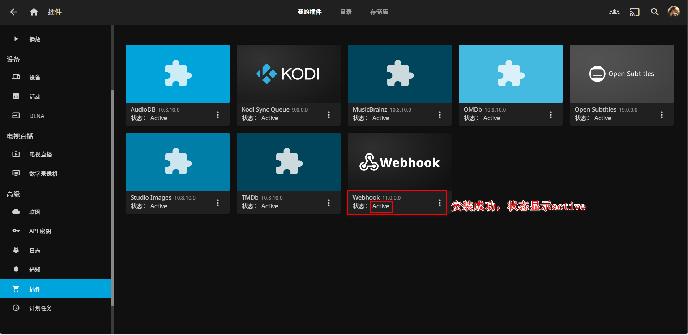
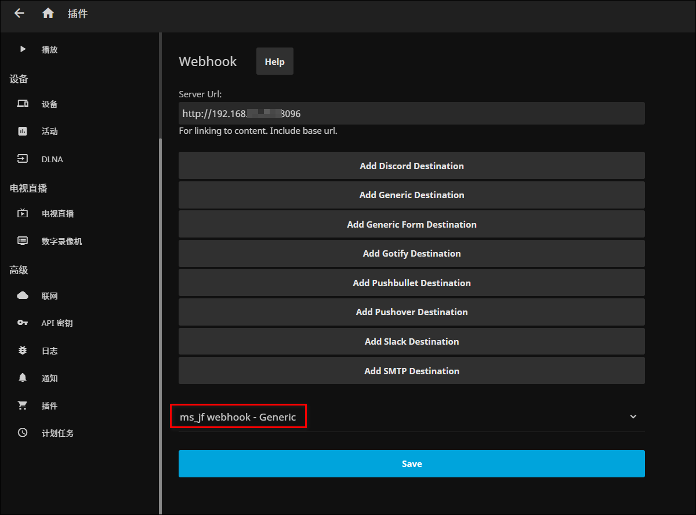

# 🪝 Webhook

Webhook是一种轻量级的回调机制，允许外部服务在特定事件发生时通知Media Saber。通过配置Webhook，您可以实现第三方服务与Media Saber的实时通信，自动触发相关操作。媒体服务器集成只是其中一种应用场景。

## 🎯 支持的Webhook类型

Media Saber支持以下类型的Webhook集成：

- Emby Webhook
- Jellyfin Webhook
- Plex Webhook
- 开放消息渠道Webhook

## 📨 开放消息渠道 Webhook

系统提供了一个开放的 Webhook 接口，允许外部系统通过配置的消息渠道发送通知。

**接口地址：** `/api/v1/message/openSend`

**请求方法：** POST

**请求头要求：**
- Content-Type: application/json
- apiKey: 您的API密钥（获取方法请参考[我的信息](/docs/main_page/my_info/)） 不一定需要添加请求头，使用此接口需要API密钥认证，请参考统一的[API鉴权文档](/docs/other/api_auth)了解详细信息。

**请求体格式：**
```json
{
  "title": "消息标题",
  "content": "消息内容",
  "imageUrl": "https://example.com/image.jpg",
  "proxy": false
}
```

| 参数 | 类型 | 必填 | 说明 |
|------|------|------|------|
| title | string | 是 | 消息标题 |
| content | string | 是 | 消息内容 |
| imageUrl | string | 否 | 完整的图片地址（可选） |
| proxy | bool | 否 | 是否需要代理（可选），开启后图片将转换为ms接口代理地址 |


### 📝 请求示例

**使用 cUrl:**
```
curl -X POST "http[s]://your-domain.com[:port]/api/v1/message/openSend" \
  -H "Content-Type: application/json" \
  -H "apiKey: your-api-key" \
  -d '{"title": "消息标题", "content": "消息内容"}'
```

**使用 wget:**
```
wget -qO- "http[s]://your-domain.com[:port]/api/v1/message/openSend" \
  --header="Content-Type: application/json" \
  --header="apiKey: your-api-key" \
  --post-data='{"title": "消息标题", "content": "消息内容"}'
```

**使用 JavaScript fetch:**
```
fetch('http[s]://your-domain.com[:port]/api/v1/message/openSend', {
  method: 'POST',
  headers: {
    'Content-Type': 'application/json',
    'apiKey': 'your-api-key'
  },
  body: JSON.stringify({
    title: '消息标题',
    content: '消息内容'
  })
})
.then(response => response.json())
.then(data => console.log(data))
.catch(error => console.error('Error:', error));
```


### 🔐 安全说明

使用此接口需要API密钥认证，请参考统一的[API鉴权文档](/docs/other/api_auth)了解详细信息。

### ⚠️ 注意事项

1. 请确保API密钥的安全性，不要在公开场合泄露
2. 发送的消息将通过系统中配置的消息渠道进行推送
3. 可以在消息通知页面测试配置的消息渠道是否正常工作

### 🛠 常见应用配置示例

#### 青龙面板

在青龙面板的配置文件中添加以下配置：

```
## 14. 自定义推送
export WEBHOOK_URL="http[s]://your-domain.com[:port]/api/v1/message/openSend"
export WEBHOOK_HEADERS="Content-Type:application/json"$'\n'"apiKey:your-api-key"
export WEBHOOK_BODY='title:$title
content:$content'
export WEBHOOK_METHOD="POST"
export WEBHOOK_CONTENT_TYPE="application/json"
```

其中：
- `your-domain.com[:port]` 是您的Media Saber服务地址和端口
- `your-api-key` 是您的API密钥

#### QD签到框架

在QD签到框架中，通过"工具箱-自定义推送"进行配置：

- 请求方法：POST
- 地址：`http[s]://your-domain.com[:port]/api/v1/message/openSend`
- Header配置：
  ```json
  {
    "apiKey": "your-api-key"
  }
  ```
- 类型：application/json
- POST Data：
  ```json
  {
    "title": "{t}",
    "content": "{log}"
  }
  ```

其中：
- `your-domain.com[:port]` 是您的Media Saber服务地址和端口
- `your-api-key` 是您的API密钥
- `{t}` 和 `{log}` 是QD签到框架的内置占位符


## 🎬 Emby/Webhook配置

**1. 进入Webhook设置**

打开Emby控制台，进入`设置` → `服务器` → `Webhook`，点击`添加Webhook`：


**2. 配置Webhook参数**

填写以下信息：

- **名称**：自定义Webhook名称
- **URL**：`http[s]://your-domain.com[:port]/api/v1/webhook/emby?apiKey=your-api-key`
- **请求内容类型**：选择`application/json`

> 🔑 **API Key配置**：请参考[API鉴权文档](/docs/other/api_auth/)获取配置说明

配置完成后可以点击`发送测试Webhook`验证配置：


**3. 验证测试消息**

配置成功后，Media Saber应该会收到一条测试信息：


**4. 配置事件和用户**

继续选择要触发通知的事件、用户和媒体库，按需选择您想监控的选项：


**5. 完成配置**

填写完所有信息后，点击`添加Webhook`完成配置：


**6. 测试功能**

此时在Emby中操作您刚刚勾选的事件时，Media Saber会收到相关信息通知：


## 🐙 Jellyfin Webhook配置

> GitHub文档说明：<https://github.com/jellyfin/jellyfin-plugin-webhook>

**1. 安装Webhook插件**

打开Jellyfin控制台，进入`插件` → `目录`，找到Webhook插件并点击：


点击`安装Webhook`：


**2. 重启Jellyfin服务**

安装完成后会提示重启Jellyfin服务，按要求重启后状态显示`active`表示成功：



**3. 配置Webhook**

在插件设置中，填写以下信息：

- **Server Url**：Jellyfin服务器URL
- 点击`Add Generic Destination`按钮新增一个Hook

配置以下参数：

- **Webhook Name**：自定义Webhook名称
- **Webhook Url**：`http[s]://your-domain.com[:port]/api/v1/webhook/emby?apiKey=your-api-key`
- **Notification Type**：勾选你想触发通知的通知类型
- **User Filter**：勾选你想触发通知的用户
- **Item Type**：勾选你想监控的媒体类型
- **Send All Properties** 和 **Template**：二选一即可，默认勾选`Send All Properties (ignores template)`
- 点击`Add Request Header`，新增一组请求头：
  - Key: `Content-Type`
  - Value: `application/json`

设置完成后点击保存：


**4. 完成配置**

此时Webhook设置完成：



**5. 测试功能**

在Jellyfin中操作您勾选的通知类型时，Media Saber会收到相关信息：


**6. 调试日志（可选）**

如果Webhook未正常工作，可以启用调试日志来排查问题。

编辑`logging.default.json`文件，在文档中的"Serilog"下添加一行内容：

```json
"Jellyfin.Plugin.Webhook": "Debug"
```

记得在`"System": "Warning"`的末尾添加逗号：


## 🎬 Plex Webhook配置

**1. 进入Webhook设置**

打开Plex控制台，进入`设置` → `Webhook`：

**2. 添加Webhook**

点击`添加Webhook`按钮，输入以下信息：

- **URL**：`http[s]://your-domain.com[:port]/api/v1/webhook/plex?apiKey=your-api-key`

> 🔑 **API Key配置**：请参考[API鉴权文档](/docs/other/api_auth/)获取配置说明

**3. 完成配置**

点击保存完成Webhook配置。

**4. 测试功能**

在Plex中播放或操作媒体时，Media Saber会收到相关信息通知。

## ⚠️ 注意事项

1. **网络连接**：确保Media Saber服务地址可以从媒体服务器访问
2. **API Key配置**：正确配置API Key以确保身份验证通过，详细获取方法请参考 [我的信息 - API KEY管理](/docs/main_page/my_info/#-api-key-管理)
3. **事件选择**：根据实际需求选择合适的事件类型，避免过多不必要的通知
4. **连接监控**：定期检查Webhook连接状态，确保通信正常
5. **性能优化**：在生产环境中建议关闭调试日志以提升性能