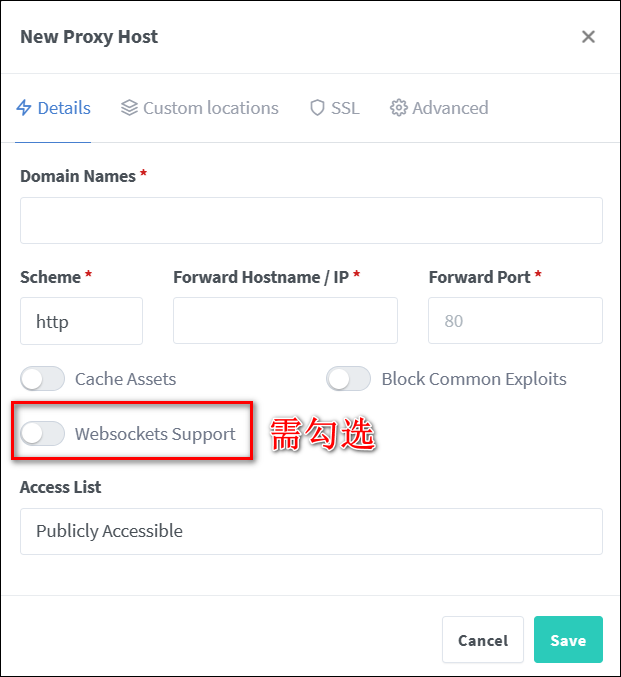

# 引言

>【Start：请勿外传，请勿外传，请勿外传】

安卓和IOS客户端均需要升级到2.5.5版本，或者最新beta版本。

## 1、下载安装

- [安卓安装](/client/android/install/)
- [IOS安装](/client/ios/install/)

## 2、消息通知

1）在系统设置-消息通知-APP推送配置里选择对应的推送渠道。

2）如果使用了外部反向代理，需要开启ws代理，才能app消息和日志交互。比如使用NPM的话：

