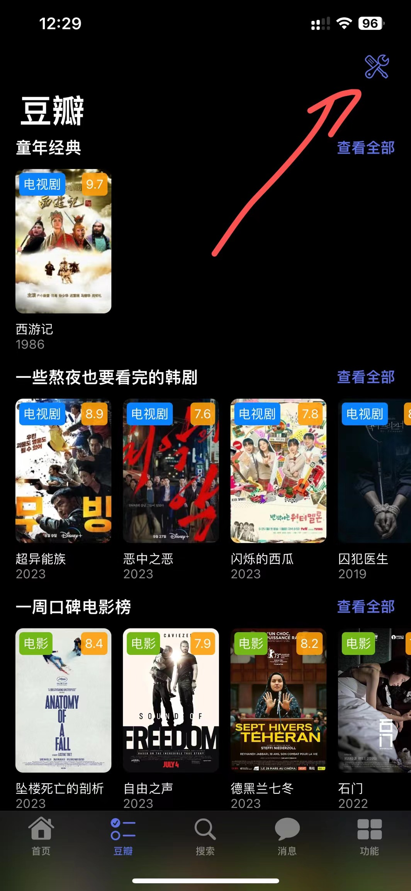
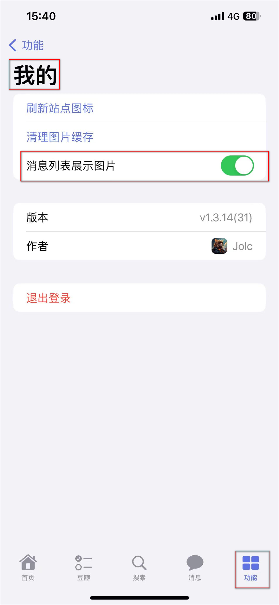

## 登录

服务器地址：MS 服务地址（如：http://192.168.3.1:3000，也可填域名）  
用户名：MS 用户名  
密码：MS 密码   
选择、删除：用于多 MS 服务管理

## 影片预览

长按影片格子(任意界面，只要有影片格子的地方都能预览)，预览影片信息，以及进行搜索、下载、订阅操作

## 豆瓣自定义

基于豆瓣豆列、片单打造类似于榜单推荐、精彩发现的功能，相对而言较个性化。  
首先在豆瓣找到豆列或者片单，或者自己创建豆列或片单，点击右上角点点点复制链接。

PS：豆瓣列表 iOS17+ 有点小问题，至少添加两个豆列且全部将开关打开才能显示正常。

### 添加豆列或片单

导入豆列或片单，支持 ID 或链接，如需在豆瓣界面显示，打开开关即可。

长按拖拽排序，控制豆瓣界面显示的顺序。

效果图

### 推荐豆列

[今日上线新片](https://www.douban.com/doulist/156792838/?dt_dapp=1)

### 如何一键下载20部电影

<video width="222" height="480" controls>
  <source src="./video/doulist_subscribe.mp4" type="video/mp4">
</video>

## 小组件

长按桌面添加小组件

## 快捷指令

添加 MS 快捷指令，进行搜索、订阅、签到等操作；  
添加后可以直接点击、嘿 Siri 快捷操作；    
也可以对快捷指令进行参数修改创建更多的快捷指令；

## 信息显示图片

点击功能-我的，打开`消息列标展示图片`。

