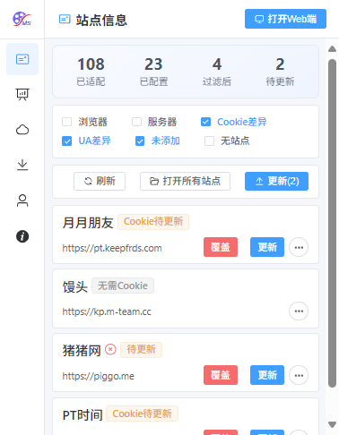
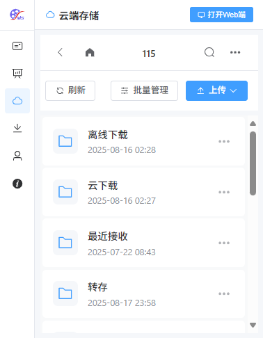
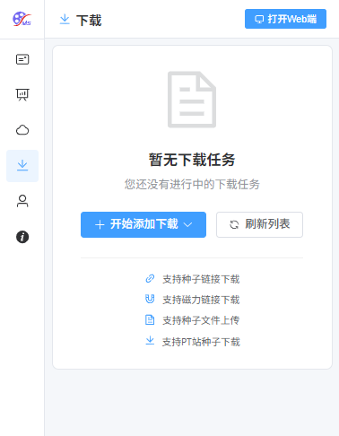
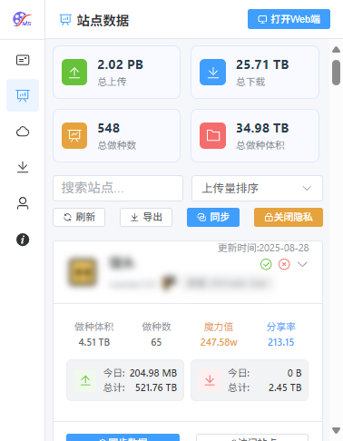
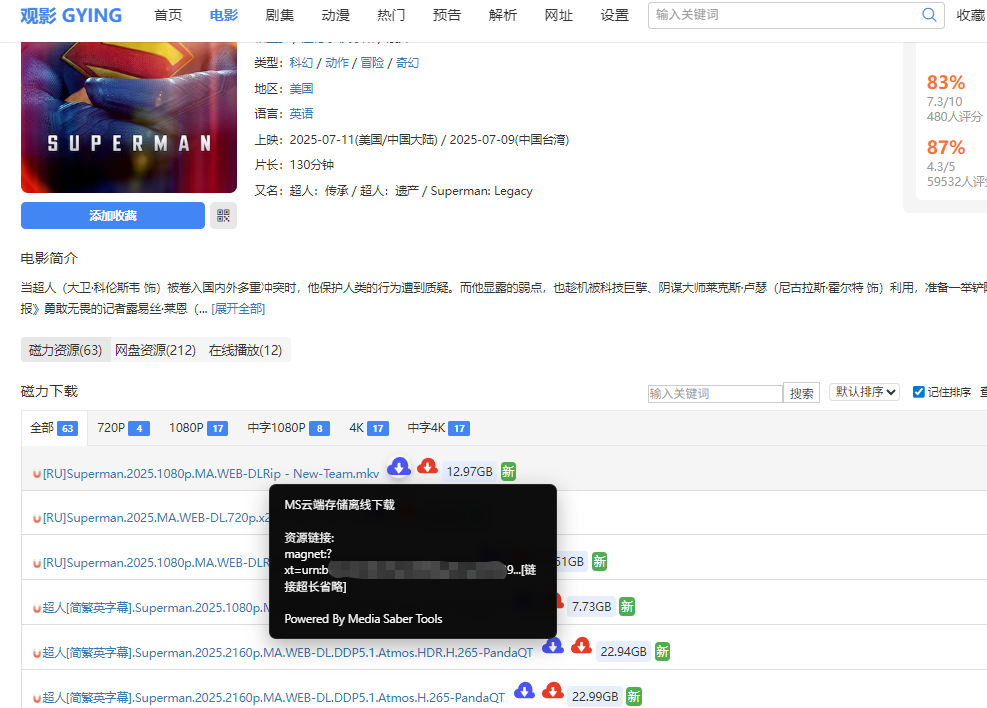
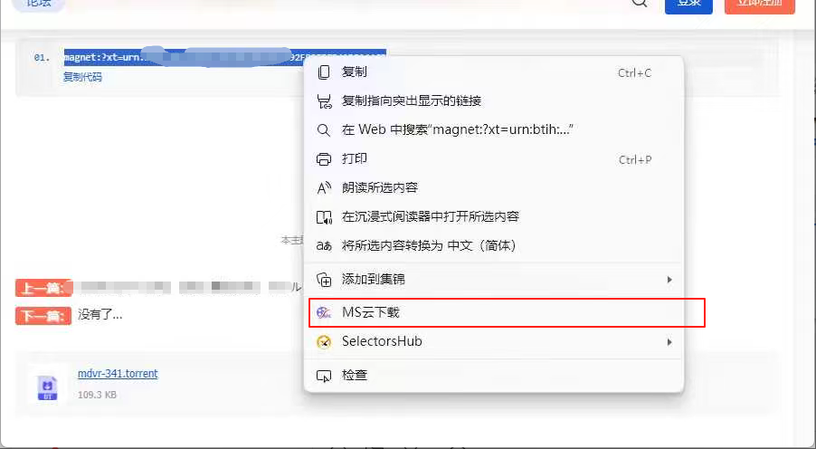
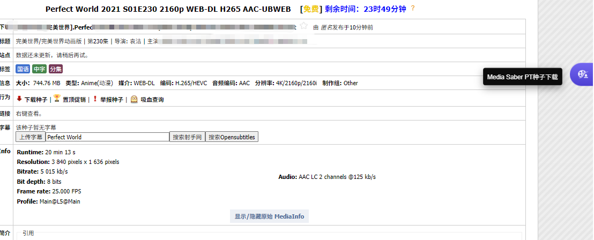

## 介绍

media saber Tools浏览器扩展是专为Media Saber定制的浏览器扩展工具， 可以一键维护站点Cookie，避免站点cookie失效导致无法访问站点，还能在站点一键下载资源等功能。

### 主要功能：
- 1、有配置文件，且浏览器有Cookie的站点，可以添加到ms中
- 2、支持一键更新MS的cookie
- 3、支持一键打开Media Saber功能
- 4、支持 一键新窗口打开所有站点功能
- 5、支持删除未添加站点浏览器cookie  
- 6、ed2k和磁力链 链接右侧增加MS云下载图标，点击后使用MS后台服务下载到默认网盘的默认路径   
- 7、链接文本选中 浏览器右键增加MS云下载，复制网页链接文本后，可以使用右键一键云下载到网盘 
- 8、支持NexusPHP框架的PT站 详情页一键下载功能
- 9、支持云端存储管理功能，可上传文件、转存链接和离线下载
- 10、支持下载管理功能，可查看和管理正在进行的下载任务
- 11、支持站点数据统计功能，可查看各站点的上传下载数据
- 12、支持右键菜单快速访问扩展功能

## 主界面截图

## 站点管理功能

### 站点信息
站点信息页面展示了所有支持的站点及其配置状态，可以一键更新Cookie和User-Agent信息。

### 站点数据统计
站点数据统计页面展示了各个站点的上传和下载数据统计信息。

## 云端存储功能

### 文件管理
云端存储页面提供了完整的文件管理功能，包括：
- 文件和文件夹浏览
- 批量操作（移动、复制、删除）
- 搜索功能
- 新建文件夹

### 上传功能
支持多种上传方式：
- 文件上传
- 链接转存
- 离线下载

## 下载管理功能

### 正在下载任务
下载管理页面展示了所有正在进行的下载任务，可以查看下载进度、速度等信息。

### 添加下载
支持多种添加下载方式：
- 种子链接下载
- 磁力链接下载
- 种子文件上传
- PT站种子下载

## 插件安装

### 浏览器扩展安装

可直接在 谷歌浏览器/Edge浏览器 扩展商店搜索"Media Saber Tools"安装。也可通过链接安装。

edge 链接：<a href="https://microsoftedge.microsoft.com/addons/detail/hlpcdobmkgdflggmhpmgoejbfjndpadb" target="_blank">https://microsoftedge.microsoft.com/addons/detail/hlpcdobmkgdflggmhpmgoejbfjndpadb</a>

谷歌链接：<a href="https://chromewebstore.google.com/detail/media-saber-tools/ibflljhbofedginadhkfehbpbefijfid" target="_blank">https://chromewebstore.google.com/detail/media-saber-tools/ibflljhbofedginadhkfehbpbefijfid</a>

## 使用说明
 
### 登录

- 服务地址: Mediasaber服务地址，比如 http://10.11.11.22:8888
- 用户名：Mediasaber管理员用户名
- 密码：Mediasaber管理员密码

### 站点管理
在站点信息页面，您可以：
- 查看所有支持的站点及其状态
- 一键更新站点Cookie和User-Agent
- 打开所有已配置的站点
- 查看站点详细信息

### 云端存储管理
在云端存储页面，您可以：
- 浏览云端文件和文件夹
- 上传文件
- 转存链接内容
- 离线下载网络资源

### 下载管理
在下载页面，您可以：
- 查看正在进行的下载任务
- 添加新的下载任务
- 管理下载任务（暂停、恢复、删除等）

### 磁力链一键下载
在任意网站的ed2k和磁力链 链接右侧增加MS云下载图标，点击后使用MS后台服务下载到默认网盘的默认路径   

### 复制磁力链右键一键下载
在任意网页，选中文本，比如磁力链接后，鼠标右键，右键菜单会出现【MS云下载】菜单选项，点击一键云下载到到默认网盘的默认路径

### NexusPHP 框架PT站详情页 通过MS一键下载种子
NexusPHP框架的PT站 种子详情页右侧会出现MS下载按钮，点击一键下载该种子

### 右键菜单功能
浏览器右键菜单提供快速访问功能：
- 离线下载：选中文本后右键，可快速添加离线下载任务
- 云盘转存：选中文本后右键，可快速添加云盘转存任务
- 磁力链接下载：选中磁力链接后右键，可快速添加磁力链接下载任务
- 站点信息：右键页面，可快速打开站点信息页面
- 站点数据页面：右键页面，可快速打开站点数据统计页面
- 云端存储页面：右键页面，可快速打开云端存储页面
- 下载管理页面：右键页面，可快速打开下载管理页面
- 用户信息页面：右键页面，可快速打开用户信息页面
- 关于页面：右键页面，可快速打开关于页面

## 更新日志

### 1.3.0：
- 适配GO版本站点cookie和ua更新
- 有配置文件，且浏览器有Cookie的站点，可以添加到ms中
- 支持NP类型的站点种子页一键下载种子
- 用户信息，头像等支持显示

### 1.3.1：
- 新增一键打开Media Saber功能
- 新增 站点列表刷新功能
- 新增 一键新窗口打开所有站点功能
- fix:打开插件时尝试重新获取站点信息

### 1.3.4：
- 支持删除未添加站点浏览器cookie  
- ed2k和磁力链 链接右侧增加MS云下载图标，点击后使用MS后台服务下载到默认网盘的默认路径   
- 浏览器右键增加MS云下载，复制网页链接文本后，可以使用右键一键云下载到网盘 

### 1.4.0：
- 新增云端存储管理功能
- 新增下载管理功能
- 新增站点数据统计功能
- 新增右键菜单快速访问功能
- 优化移动端适配
- 优化用户界面体验