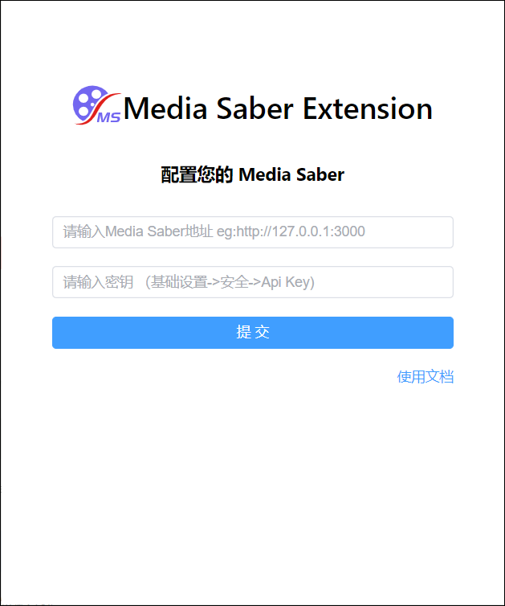
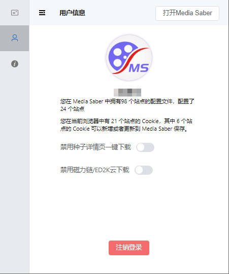
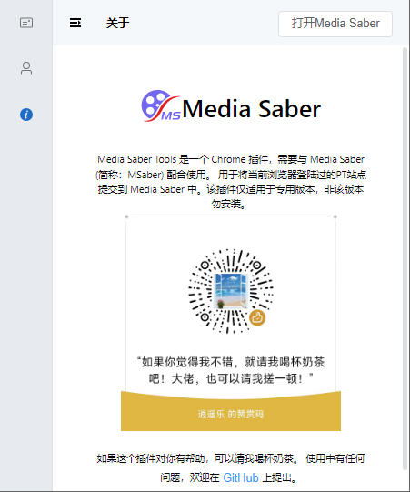
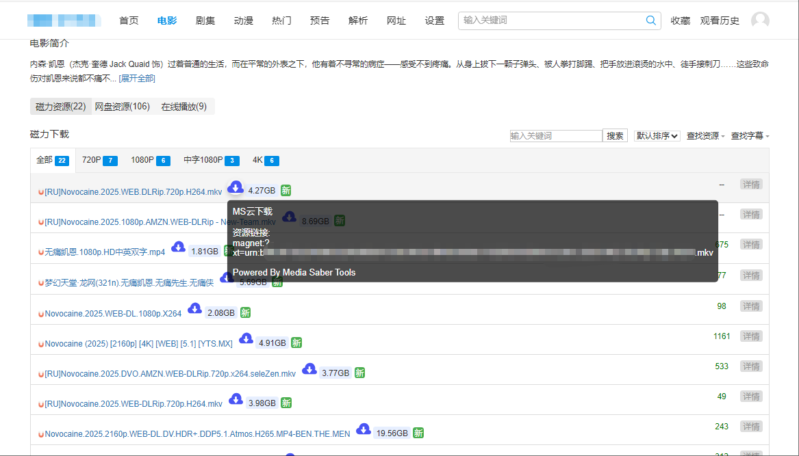
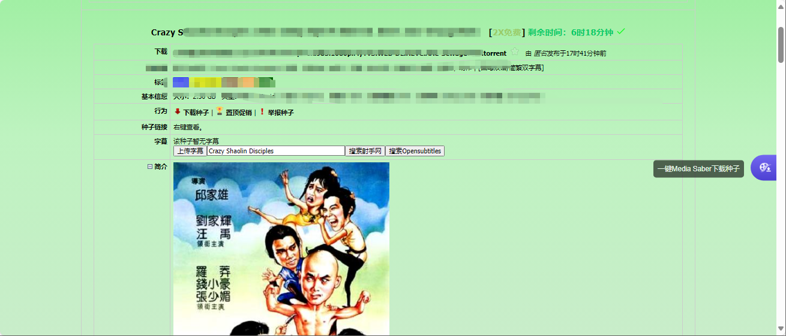

## 介绍

media saber Tools浏览器扩展是专为Media Saber定制的浏览器扩展工具， 可以一键批量或者单个维护添加MS站点或者更新 MS 的 cookie ，也可使用 MS 的cookie回填到浏览器，避免站点cookie失效导致无法访问站点。

## 插件安装

### 浏览器扩展安装

可直接在 谷歌浏览器/Edge浏览器 扩展商店搜索“Media Saber Tools”安装。也可通过链接安装。

edge 链接：<a href="https://microsoftedge.microsoft.com/addons/detail/hlpcdobmkgdflggmhpmgoejbfjndpadb" target="_blank">https://microsoftedge.microsoft.com/addons/detail/hlpcdobmkgdflggmhpmgoejbfjndpadb</a>

谷歌链接：<a href="https://chromewebstore.google.com/detail/media-saber-tools/ibflljhbofedginadhkfehbpbefijfid" target="_blank">https://chromewebstore.google.com/detail/media-saber-tools/ibflljhbofedginadhkfehbpbefijfid</a>

## 功能介绍

主要功能：
1、有配置文件，且浏览器有Cookie的站点，可以添加到ms中
2、支持一键更新MS的cookie
3、支持一键打开Media Saber功能
4、支持 一键新窗口打开所有站点功能
5、支持删除未添加站点浏览器cookie  
6、ed2k和磁力链 链接右侧增加MS云下载图标，点击后使用MS后台服务下载到默认网盘的默认路径   
7、链接文本选中 浏览器右键增加MS云下载，复制网页链接文本后，可以使用右键一键云下载到网盘 
8、支持NexusPHP框架的PT站 详情页一键下载功能
8、其他功能

## 使用说明
 
 ### 登录

 - 服务地址: Mediasaber服务地址，比如 http://10.11.11.22:8888
 - 用户名：Mediasaber管理员用户名
 - 密码：Mediasaber管理员密码

 ### 磁力链一键下载
在任意网站的ed2k和磁力链 链接右侧增加MS云下载图标，点击后使用MS后台服务下载到默认网盘的默认路径   
 

 ### 复制磁力链右键一键下载
在任意网页，选中文本，比如磁力链接后，鼠标右键，右键菜单会出现【MS云下载】菜单选项，点击一键云下载到到默认网盘的默认路径
 

### NexusPHP 框架PT站详情页 通过MS一键下载种子
NexusPHP框架的PT站 种子详情页右侧会出现MS下载按钮，点击一键下载该种子
 

## 更新日志

### 1.3.0：
- 适配GO版本站点cookie和ua更新
- 有配置文件，且浏览器有Cookie的站点，可以添加到ms中
- 支持NP类型的站点种子页一键下载种子
- 用户信息，头像等支持显示

### 1.3.1：
- 新增一键打开Media Saber功能
- 新增 站点列表刷新功能
- 新增 一键新窗口打开所有站点功能
- fix:打开插件时尝试重新获取站点信息

### 1.3.4：
- 支持删除未添加站点浏览器cookie  
- ed2k和磁力链 链接右侧增加MS云下载图标，点击后使用MS后台服务下载到默认网盘的默认路径   
- 浏览器右键增加MS云下载，复制网页链接文本后，可以使用右键一键云下载到网盘 