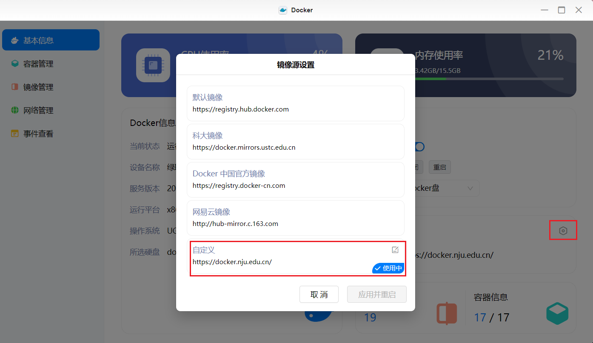
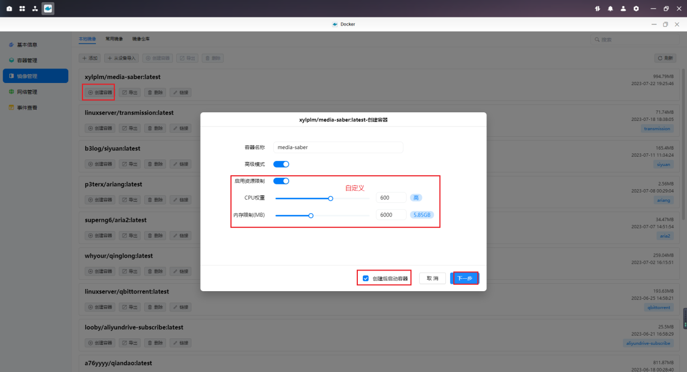
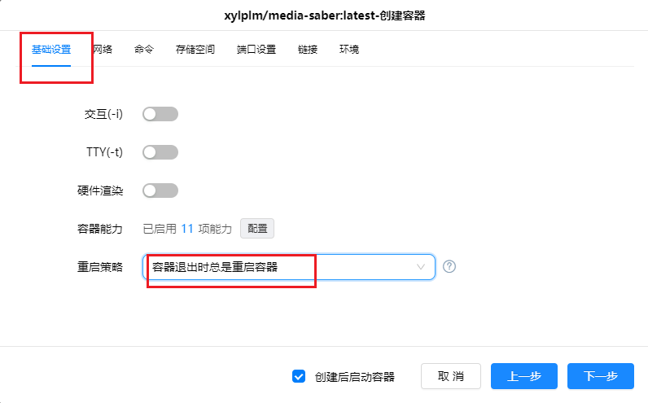
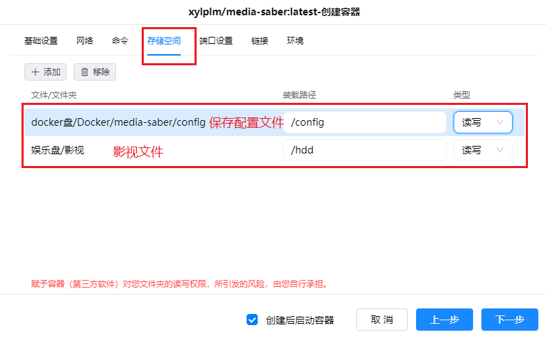
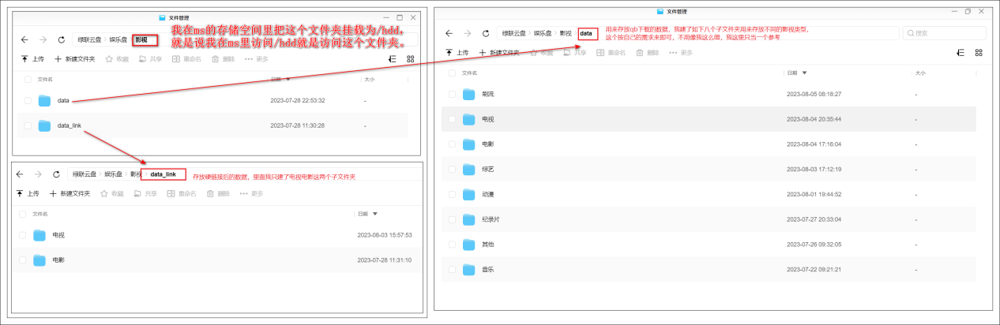
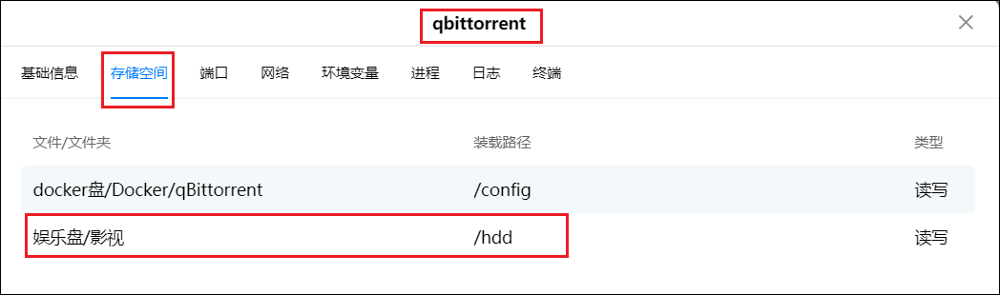
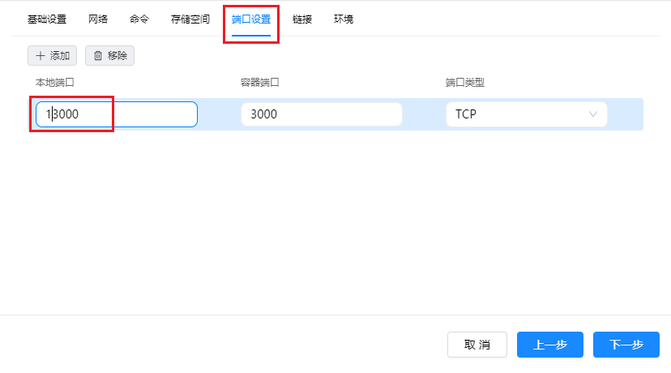
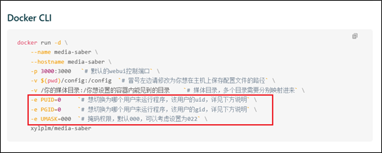
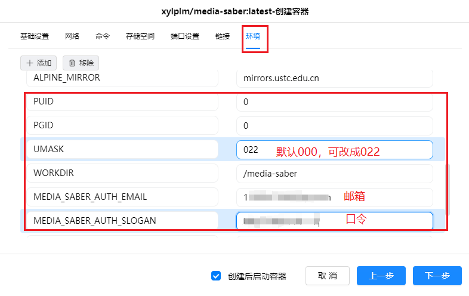
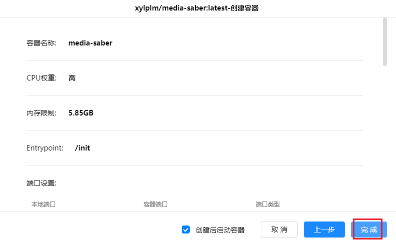

> 感谢`@宝山寨小夏` 为大家带来，绿联 NAS 的 MS 安装教程。

 
> 为了项目的安全性，请一定要注意：`请勿外传！请勿外传！请勿外传！请勿外传！请勿外传！`
> 需要自行添加`激活密钥`，这里不说明是什么
 

Ps：Media Saber Wiki 使用文档及更新日志：[https://wiki.msaber.fun/](https://wiki.msaber.fun/)

## 1. 容器安装

1. 搜索 xylplm，点击下载，没特殊要求选择最新版本
   

如果下载失败可以换换镜像源，我是自定义的这个镜像源【https://docker.nju.edu..cn/】，感觉拉取速度和成功率都很好，还是不行的话就在选择版本那停一下，多试几次，再不行就另找大佬求助吧。

2. 创建容器，容器名称自定义，一般默认，限制这里也是自定义，可以不设置，可以勾选上创建后重启容器。

3. 基础设置选择容器退出时总是重启容器

4. 我的存储空间设置如下

这里仔细的说下我的绿联存储空间里影视文件夹的设置，仅供参考。

Ps 大家影视文件夹挂载最好和 qb 统一，比如我的是统一的

5. 本地端口我这里是 3000 被 nastool 使用，就填写的 13000，一般还是写默认的 3000.

6. 环境填写

Wiki 文件夹里说的这几项大家按需求来，一般 PUID 和 PGID 是默认为 0.

另外需要填写的就是：

MEDIA_SABER_AUTH_EMAIL 对应申请时的邮箱

MEDIA_SABER_AUTH_SLOGAN 对应申请时的口令

7. 确认无误后点击完成

