> 感谢`@陈洋` 陈老师 为大家带来，如何进行安装后的第一次配置。

## 一、基础设置

### 1、TMDB api 申请

打开[TMDB 官网](https://www.themoviedb.org/signup)，注册账号并登录。

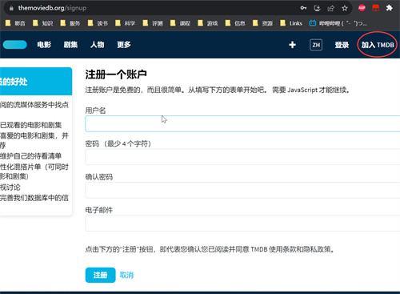

打开[https://www.themoviedb.org/settings/api](https://www.themoviedb.org/settings/api)，点击`请求api秘钥`下`click here`，选择`developer`，填些英文描述，最后得到一串`TMDB API密钥`备用。
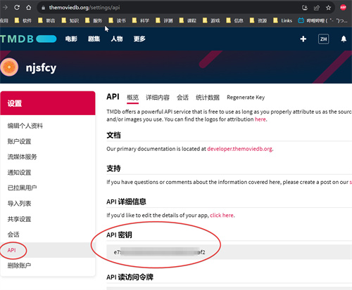

### 2、MSaber 初始化

打开[http://极空间 IP:3000]，登录 msaber，用户名 admin，密码 password。打开系统设置，修改 WEB 管理密码。
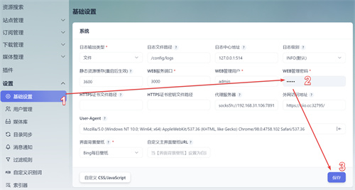

下方媒体填入`TMDB API密钥`，（还可更改你的转移方式，刮削设置）
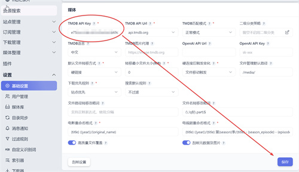

这时，你的 msaber 应该能显示漂亮的海报墙和榜单了。


### 3、QBittorrent 初始化

打开[http://极空间 IP:30001],登录 qbit，用户 admin，密码 adminadmin，打开设置下载位置改成`/media/下载`，WebUI 语言选择中文，修改 qb 密码。
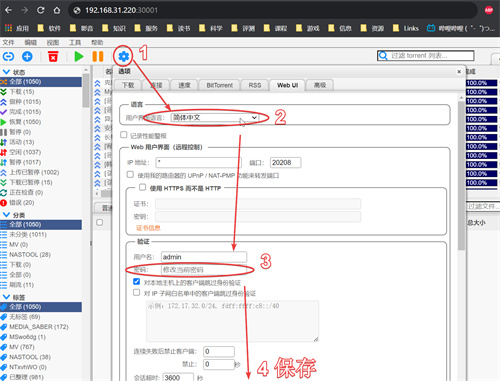

## 二、站点资源

### 1、索引器

media saber 不提供任何资源！但有热心网友贡献了站点文件。
点击进入 [pre-dessert-sites github](https://github.com/mantou568/pre-dessert-sites)

`一键更新命令：`在 docker 管理页，点击 msaber 容器下方 ssh 按钮，进 bash 命令行输入
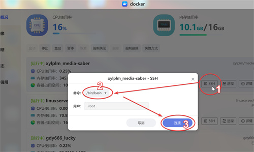

```shell
cd /config && wget https://ghproxy.com/https://github.com/mantou568/pre-dessert-sites/archive/refs/heads/main.zip && unzip main.zip && rm -r sites && mkdir sites && cp -r pre-dessert-sites-main/sites/* sites/ && rm -r pre-dessert-sites-main main.zip && reboot
```

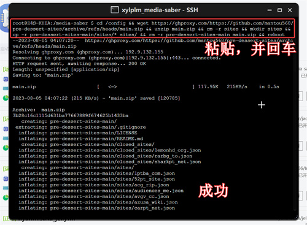
它会下载站点配置到`/高速存储/docker/msaber/sites`并自动重启容器。请稍等一分钟再用（设置 → 索引器），此后索引器里多了一堆 BT 站点，可以检索部分电影资源（慢）。

### 2、站点配置

MSaber 可以帮我们签到，刷流，下载 PT 资源。点开站点管理：站点维护：新增站点，填入`站点名称`、`站点地址`、`COOKIE`，`RSS订阅地址`，然后保存。
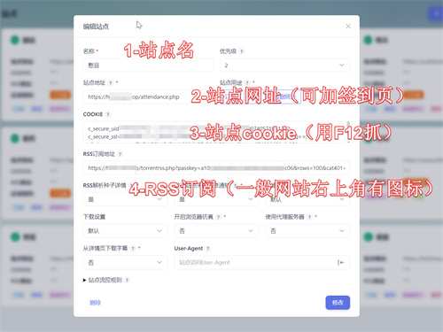

此后索引器里多出相应的 PT 站点，可以检索大量资源。
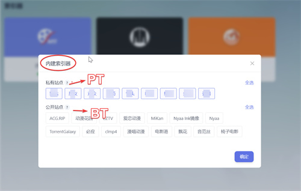

## 三、下载器设置

### 1、MSaber 设置：下载器

新增下载器，填入`极空间IP`，端口`30001`，用户`admin`，密码`修改的qb密码`，监控`是`（非常重要），标签隔离`是`。
下载器目录，填入以下内容：

> `/media/下载/电影` 和 `/media/下载/电影`

> `/media/下载/剧集` 和 `/media/下载/剧集`

> `/media/下载/动漫` 和 `/media/下载/动漫`

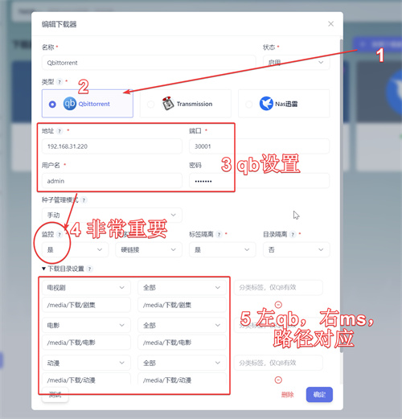
（左边是 qb 下载路径，右边是 ms 管理文件路径，我们设置的俩容器路径一致）

### 2、MSaber 设置：媒体库

在 MSaber 设置找到媒体库，分别通过鼠标点选出：

> `/media/电影`

> `/media/剧集`

> `/media/动漫`

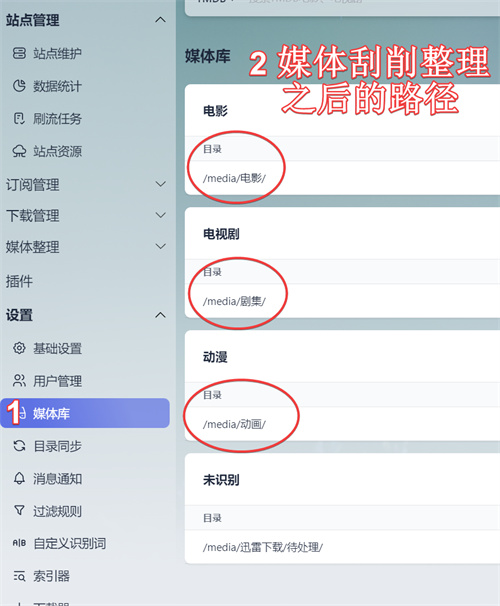
这样你下载源文件都在`/media/下载/`下存放，而 ms 会自动把这些影视重命名整理好，分类放到`电影`、`剧集`、`动漫`中去。
