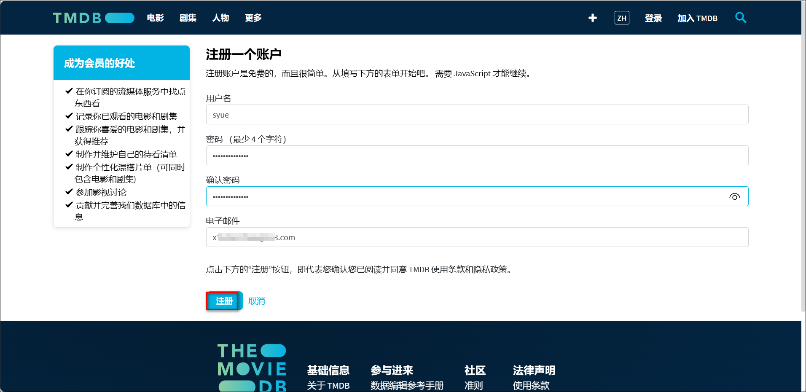
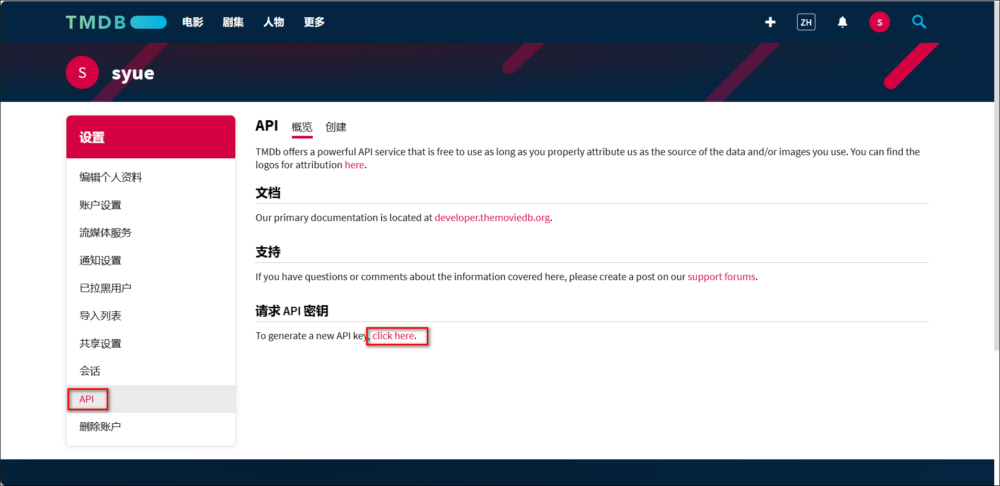
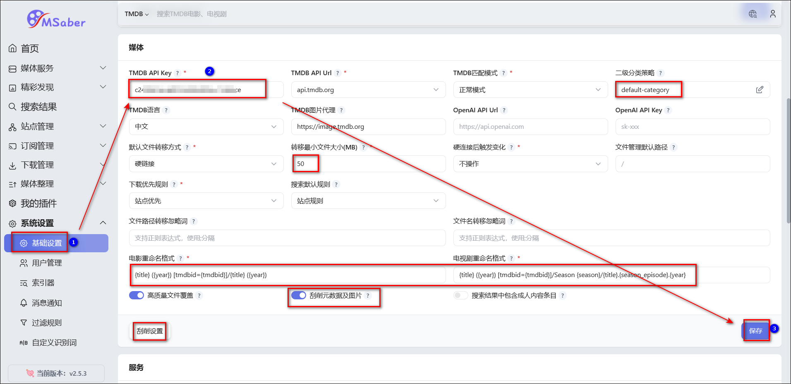

### 1、申请TMDB API

1、点击进入[TMDB官网](https://www.themoviedb.org/)，点击【加入TMDB】。

2、按照要求输入相关信息完成注册。

3、注册完成以后会收到封验证邮件，点击`ACTIVATE MY ACCOUNT`激活账户。

4、登录TMDB。

5、点击右上角的头像-帐户设置。

6、点击左侧的API，然后点击请求API秘钥下面的 click here。

7、点击开发者（Developer）。

8、协议滑动到最后选择接受。

9、名称自定义，应用URL填写绿联IP，应用简介按照写api用途（最好填写英语，百度翻译即可）然后点击提交。

应用简介参考（填写英文部分）：满足个性定制化需求，丰富网站接口以及功能（`Meet personalized needs, enrich website interfaces and functions`）。

10、这样我们就获取到了TMDB的API密钥，复制下来保存，后面我们会用到。

### 2、MSaber 初始化

1）在浏览器输入IP:端口，进入msaber登录页面，用户名默认是 admin，密码默认是 password。登陆后打开系统设置-基础设置，在上方的系统里修改 WEB 管理密码，修改后记得保存。

2）在系统下方的媒体里填入刚刚申请好的`TMDB API Key`，这里还可更改你的刮削设置，比如二级分类策略和一些具体的刮削设置。

3）这时，你的 msaber 应该能显示漂亮的海报墙和榜单了。

