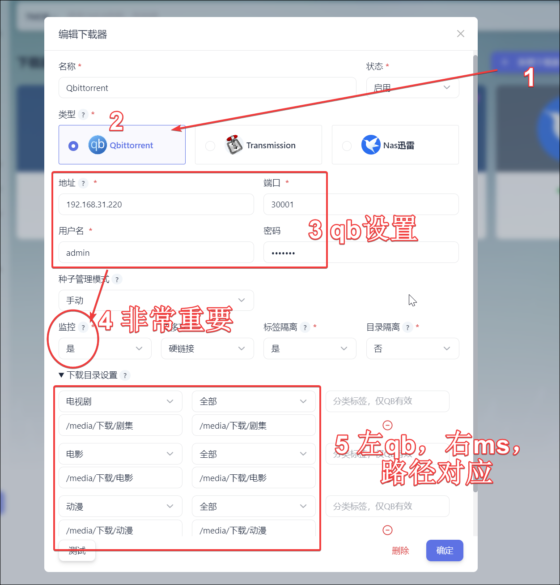

**说明**

监控下载软件与目录同步监控下载目录二选一开启即可。

下方教程里目录的设置里`/media`或`/hdd`都是自定义设置的影视文件夹的装载路径，并且目录这块为了更细致的分类，还得搭配二级分类策略，这些的设置最好是去理解然后按照自己的需求来。

### 1、监控

1、下载器设置

新增下载器，填入`下载器名称`，以及`下载器的IP地址、端口、用户、密码`，监控选`是`（非常重要）。下载器目录，填入以下内容：

> `/media/下载/电影` 和 `/media/下载/电影`

> `/media/下载/剧集` 和 `/media/下载/剧集`

> `/media/下载/动漫` 和 `/media/下载/动漫`



（左边是 qb 下载路径，右边是 ms 管理文件路径，我们设置的俩容器路径一致）

2、媒体库设置

在 MSaber 点击媒体服务-媒体库分类（图片所示路径为旧版本），分别通过鼠标点选出：

> `/media/电影`

> `/media/剧集`

> `/media/动漫`


这样你下载源文件都在`/media/下载/`下存放，而 ms 会自动把这些影视重命名整理好，分类放到`电影`、`剧集`、`动漫`中去。


### 2、目录同步

注意:这里有对二级分类策略里的tv目录进行更改。

```
# 配置电视剧的分类策略， 配置为空或者不配置该项则不启用电视剧分类
tv:
  # 分类名同时也是目录名，会按先后顺序匹配，匹配后程序会按这个名称建立二级目录
  # 如果有配置动漫独立目录，则实际上不会使用到tv下的动漫二级分类
  动漫:
    # 匹配 genre_ids 内容类型，16是动漫
    genre_ids: '16'
  纪录片:
     # 匹配 genre_ids 内容类型，99是纪录片
    genre_ids: '99'
  综艺:
    # 匹配 genre_ids 内容类型，10764 10767都是综艺
    genre_ids: '10764,10767'
  电视剧:
    # 匹配 origin_country 国家，CN是中国大陆，TW是中国台湾，HK是中国香港...
    origin_country: 'CN,TW,HK,US,FR,GB,DE,ES,IT,NL,PT,RU,UK,JP,KP,KR,TH,IN,SG'
  # 未匹配以上分类，则命名为未分类
  未分类:

```

1、下载器设置

新增下载器，填入`下载器名称`，以及`下载器的IP地址、端口、用户、密码`，监控默认`否`。下载器目录，填入以下内容：

> `/hdd/data/电影` 和 `/hdd/data_link/电影`

> `/hdd2/data/电视` 和 `/hdd2/data_link/电视`

> `/hdd/data/动漫` 和 `/hdd/data_link/电视`

> `/hdd/data/综艺` 和 `/hdd/data_link/电视`

> `/hdd/data/纪录片` 和 `/hdd/data_link/电视` 

> `/hdd/data/刷流` 和 不设置目录，不处理


2、媒体库设置

在 MSaber 点击媒体服务-媒体库分类，分别通过鼠标点选出：

> `/hdd/data_link/电影`

> `/hdd/data_link/电视`

> `/hdd2/data_link/电视`


3、目录同步设置

在 MSaber 点击媒体整理-目录同步，设置源目录——>目的目录：

> `/hdd/data/电影` ——> `/hdd/data_link/电影`

> `/hdd2/data/电视` ——> `/hdd2/data_link/电视`

> `/hdd/data/动漫` ——> `/hdd/data_link/电视`

> `/hdd/data/综艺` ——> `/hdd/data_link/电视`

> `/hdd/data/纪录片` ——> `/hdd/data_link/电视` 


