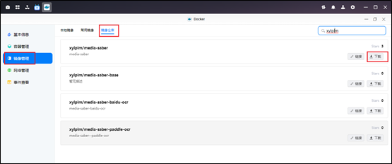
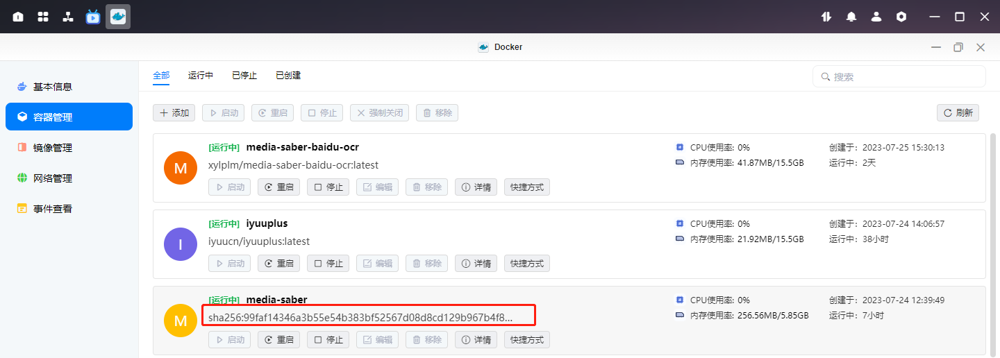
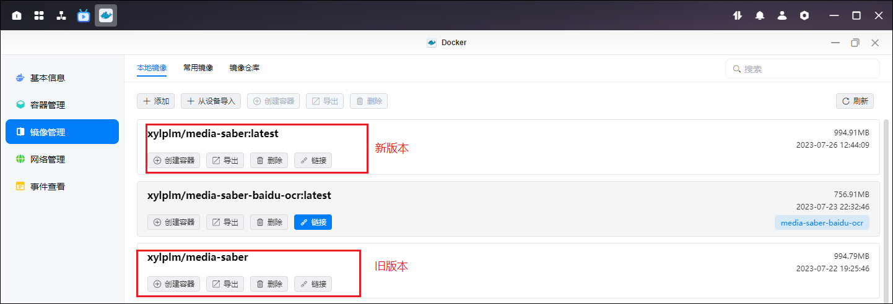
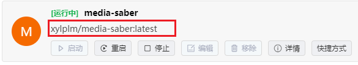

> 感谢`@宝山寨小夏` 为大家带来，绿联 NAS 的 MS 更新教程。

 
> 为了项目的安全性，请一定要注意：`请勿外传！请勿外传！请勿外传！请勿外传！请勿外传！`
> 需要自行添加`激活密钥`，这里不说明是什么
 

如果我们下载的 ms 正好是 latest 标签，那么升级就会变得非常简单，下面我来介绍一下升级过程。

如下图所示，我当前的 ms 版本号是 2.2.1 的版本，镜像仓库的最新版本是 2.3.0 号的版本。

那么我们需要在镜像管理--镜像仓库--搜索镜像，然后下载最新的版本。

在新镜像拉取完成以后，我们回到容器管理这里可以看到，本来应该显示`xylplm/media-saber:latest`的现在变成了红框的内容。

并且在镜像管理中可以看到有两个镜像。

这时我们只需点击停止，然后再点击编辑，并且什么参数都不需要再修改，只用一路点击下一步，直到最后点击完成即可，最后再启动 MS。

当我们启动成功以后，容器里面只会存在一个 MS，并且标签又变回了`xylplm/media-saber:latest`

而再次回到镜像管理中，我们又看到，我们成功在 latest 版本上启动了一个容器，而之前的镜像是没有建立容器的，这时我们就可以把这个旧版本的镜像点击删除即可。

> 总而言之，绿联的更新非常简单：拉最新镜像-停容器并无脑下一步编辑容器-启动容器-删除旧镜像即可。
