## 目录

[[toc]]

## 1.前言

在 khl.py 中，绝大部分操作都需要基于 Bot 对象来执行。所以，要想让机器人跑起来，我们要先把机器人的身体做出来，有了身体，才能让这个机器人去做我们想要做的事情

阅读本文之前，请再次确认您已经在 [kook开发者中心](https://developer.kookapp.cn/) 申请了开发者权限，并能正常进入 [开发者机器人管理后台](https://developer.kookapp.cn/bot/)

## 2.机器人管理后台

### 创建机器人

进入开发者后台-应用，点击右上角创建应用，即可创建一个新的机器人

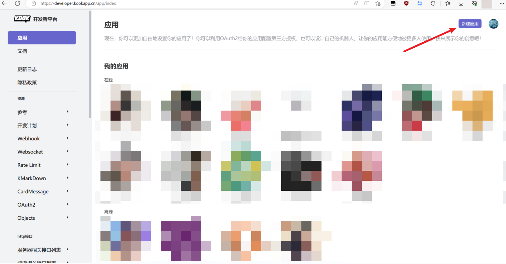

填入应用名称（即机器人名称，后续还可以更改），点击确定，创建机器人

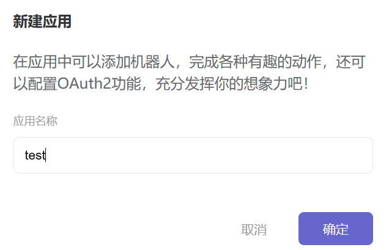

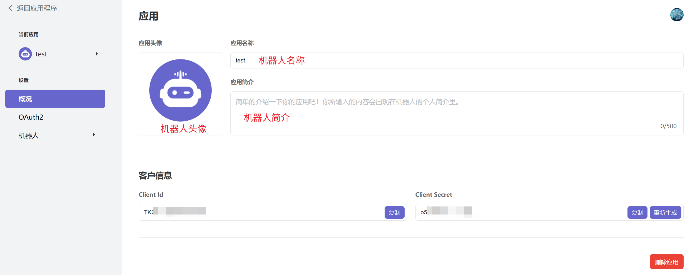

点击左侧 `机器人` 按钮，即可进入机器人 token 的页面。

### 获取机器人 token

在此页面，你可以

* 修改机器人的连接方式
* 获取机器人的token
* 是否开启公共机器人（若不开启，则只有机器人开发者可以邀请机器人到其他服务器）

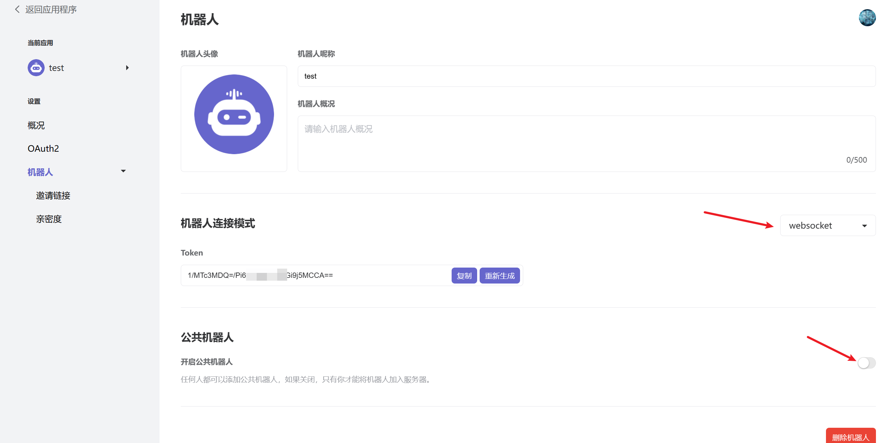

如果是webhook链接方式，则还需要填入机器人的 `Callback Url`

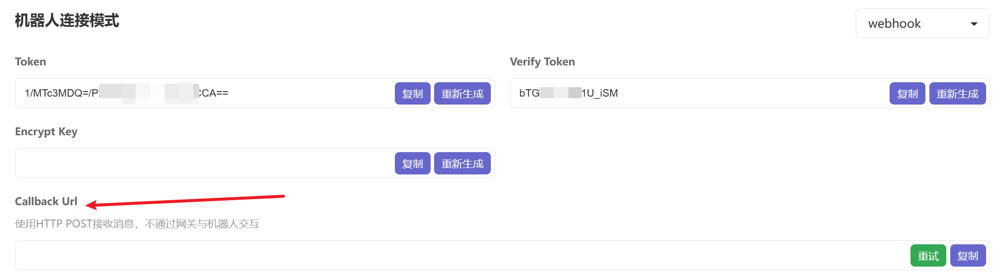

### 机器人权限

在 `邀请链接` 界面，您可以看到机器人的邀请链接，并可以设置机器人被邀请到服务器内的默认权限。

权限设置请按照机器人的功能进行选择。如果你不知道应该选择什么权限，可以无脑选择管理员。

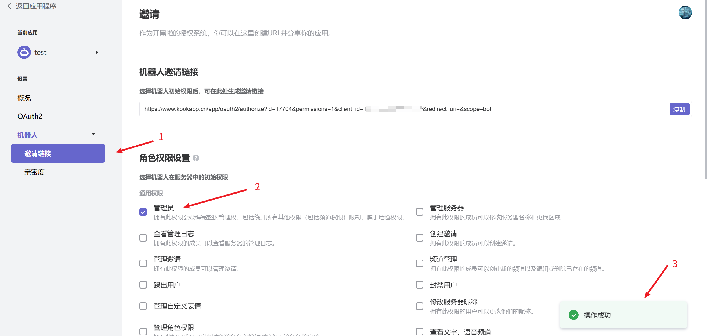

## 3.两种连接模式

KOOK的机器人有两种连接模式：

* webscoket
* webhook

列个表，来看看二者的主要区别

| websocket      | webhook                                    |
| -------------- | ------------------------------------------ |
| 不需要公网地址 | 需要一个可访问的**公网地址**               |
| 只需要token    | 除了token，还需要verify-token和encrypt-key |

在 [@musnows](https://github.com/musnows/) 的实测下，webhook 连接方式的稳定性略高于 websocket 。

* 如果你的机器人已经基本开发完毕，功能完好无bug，则更推荐使用 webhook 方式部署机器人，实现长期稳定运行；
* 如果你的机器人是部署在家中，无可用公网地址，则可以使用 websocket；
* 二者并没有严格意义上的孰强孰弱，根据自己的实际使用情况选择即可

知道了这两种方式的区别了，下面来看看如何给我们的机器人造一个身子吧！

## 4.实例化 Bot 对象

下面便是使用两种办法创建机器人对象的代码

### websocket

~~~python
from khl import Bot
## websocket
bot = Bot(token = 'token') 
~~~

### webhook

~~~python
from khl import Bot
## webhook
webhook_port = 5000 ## 机器人webhook服务绑定端口，默认为5000
webhook_route = '/khl-wh' ## 机器人webhook服务器回调地址，默认为/khl-wh
## 按如上配置，回调地址是 http://ip:5000/khl-wh
## 将此地址填入kook机器人后台的callback url，即可上线机器人
## 记得开启云服务器防火墙中对5000端口的tcp访问

bot = Bot(cert = Cert(token='token',
                      verify_token='verify_token',
                      encrypt_key='encrypt_token'),
          port=webhook_port,
          route=webhook_route
)
~~~

### 可选参数

* `compress`，是否压缩，默认为 `True`
* 其余参数基本用不上...

### 从文件读取 token

位了避免我们的机器人token在git仓库中泄漏，我们可以引入一个 `config.json` 文件，在其中写入机器人配置信息，并在启动机器人的时候，打开此文件，读取配置信息来初始化机器人

在机器人代码文件所在文件夹中，创建 `config` 文件夹，并在 `config` 文件夹中创建 `config.json`，写入如下内容

~~~json
{
    "token": "webhook/websocket bot token",
    "verify_token": "webhook verify token",
    "encrypt_token": "webhook encrypt token",
    "webhook_port": 50000,
    "using_ws": true
}
~~~

这个文件中包含了webhook/websocket所需的配置项

* 使用websocket，只需要填入 `token` 字段，并将 `using_ws` 填为 `true`
* 使用webhook，还需要填入 `verify_token/encrypt_token` 字段，选择需要绑定的端口填入 `webhook_port`，并将 `using_ws` 填为 `false`

对应的初始化机器人代码如下

~~~python
import json
from khl import Bot, Cert

def open_file(path: str):
    """打开path对应的json文件"""
    with open(path, 'r', encoding='utf-8') as f:
        tmp = json.load(f)
    return tmp

# 打开config.json
config = open_file('./config/config.json')

# 初始化机器人
bot = Bot(token=config['token'])  # 默认采用 websocket
"""main bot"""
if not config['using_ws']:  # webhook
    # 当配置文件中'using_ws'键值为false时，代表不使用websocket
    # 此时采用webhook方式初始化机器人
    print(f"[BOT] using webhook at port {config['webhook_port']}")
    bot = Bot(cert=Cert(token=config['token'],
                        verify_token=config['verify_token'],
                        encrypt_key=config['encrypt_token']),
              port=config['webhook_port'])
~~~

为了避免 `config.json` 文件中的 `token` 泄漏，可以将其写入 `.gitignore` 文件。

在你的git存储仓库的根路径创建 `.gitignore` 文件，填入如下内容

~~~
config.json
~~~

这样就会在上传文件到 github/gitee 的时候，忽略掉 `config.json`

## 5.启动

有了机器人对象，添加了机器人功能模块（这部分将在其他文档中讲解）后，就可以让机器人跑起来了！

### 直接启动

以websocket连接模式为例，使用 `bot.run()` 函数启动机器人

~~~python
from khl import Bot
## websocket
bot = Bot(token = 'token') 

## 添加功能模块
## ......

## 开跑
if __name__ == '__main__':
    bot.run() 
~~~

webhook连接模式也同此操作。二者仅仅是初始化Bot对象时的参数不同！

#### 什么是 `__name__` ?

这里给没有系统学过python的其他编程语言选手讲解一下最后这个if语句的作用

所谓 `__name__` ，可以理解为是python自带的一个全局变量，其会给每一个文件标识一个名字，写入到这个变量中。

而 `__main__` 就是 `__name__` 的一种，出现 `__main__` ，就代表当前的 `.py` 文件是我们的入口文件

~~~bash
python test.py
~~~

此时 `test.py` 就是入口文件，`__name__ == '__main__'` 为真。

有了这个判断，`bot.run()`操作就只有你直接运行这个文件的时候，才会被执行。

### 和其他异步模块一起运行

除了直接运行，我们还可以给机器人进程添加其他异步模块，集合为单个进程运行

~~~python
import asyncio
from aiohttp import web,web_request
from khl import Bot
## websocket
bot = Bot(token = 'token') 
## 初始化节点
routes = web.RouteTableDef()

## 请求routes的根节点
@routes.get('/')
async def hello_world(request:web_request.Request):
    return web.Response(body="hello")

## 添加routes到app中
app = web.Application()
app.add_routes(routes)

## 同时运行app和bot
HOST,PORT = '0.0.0.0',14725
if __name__ == '__main__':
    asyncio.get_event_loop().run_until_complete(
        asyncio.gather(web._run_app(app, host=HOST, port=PORT), bot.start()))
~~~

使用如上的代码，我们将在单个进程中，异步运行 `aiohttp.web` 实现的 http 请求处理器（app），和机器人本身（bot）

注意，如果这里的 `aiohttp.web` 服务需要外网访问，则一定要将 `HOST` 填为 `0.0.0.0`。如果是 `127.0.0.1`，是不支持外网访问的！

将如上代码写入 `test.py` 文件

~~~bash
python3.10 test.py 
~~~

运行程序，效果如下

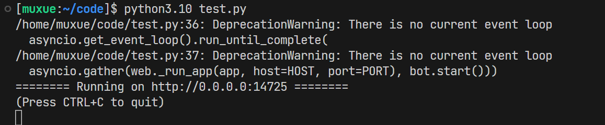

点击终端中的链接，可以在本地访问到 `aiohttp.web` 服务。

> 如果需要公网访问此链接，则需要修改为 `http://公网ip:14725`，并在防火墙中开启14725端口的tcp访问

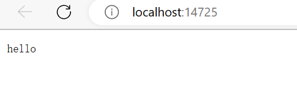

此时，两个异步程序就在单个进程中运行了！

使用相同办法，你还可以实现两个完全不同的独立机器人在单进程中执行。

#### 屏蔽 eventloop 警告

这里还出现了一个无关紧要的警告，其并不会影响程序正常运行，我们可以添加如下代码，禁止掉这个警告

~~~python
## 屏蔽报错
## ignore warning 'DeprecationWarning: There is no current event loop'
import warnings
warnings.filterwarnings("ignore", category=DeprecationWarning)
~~~

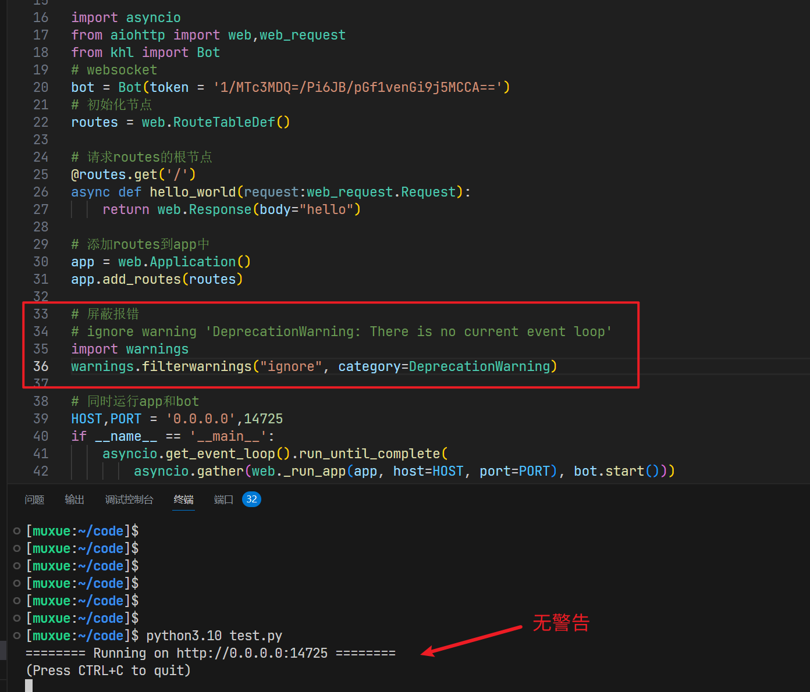

### 后台运行（Linux）

#### 使用 nohup 命令将机器人在后台运行

如果你使用的是 Linux 来部署机器人，使用 `nohup` 命令就能很方便地让机器人在后台运行

~~~bash
nohup python3.10 -u test.py >> ./nohup.log 2>&1 &
~~~

此时会创建一个后台进程，并将机器人的所有输出重定向到当前目录下的 `nohup.log` 文件中。

如果想要找到对应的进程，可以使用 `ps` 命令

~~~bash
ps axj | head -1 && ps jax | grep test.py
~~~

这个命令会找到后台运行的 `test.py` 程序，此时可以给机器人程序发送信号，让其中止

~~~bash
kill -9 进程号
~~~

进程号是 `ps` 命令输出结果中，第二列的数字

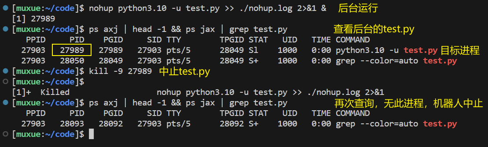

#### 使用 screen 命令将机器人在后台运行

如果你使用的是 Linux 来部署机器人，使用 `screen` 命令也能很方便地让机器人在后台运行

先执行如下命令，看看你的机器上是否已安装 `screen`。

~~~bash
screen
~~~

如果出现如下提示，则代表没有安装此命令

~~~bash
bash: screen: command not found
~~~

执行安装 `screen` 的命令

~~~bash
# centos
sudo yum install screen
# ubuntu
sudo apt-get install screen
~~~

安装完毕后，执行如下指令

~~~bash
screen -R bot
python3.10 test.py
~~~

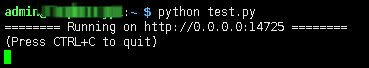

此时会创建一个"屏幕"，并将机器人的所有输出重定向到这个"屏幕"中。并且在SSH连接断开后也可继续运行。

如果想要连回创建的“屏幕”中，可以使用 `screen -r [屏幕名称]` 命令

~~~bash
screen -r bot
~~~

如果忘记连创建的“屏幕”名称，可以使用 `screen -list` 命令
该命令会列出所有创建的“屏幕”，找到你创建的“屏幕”后再执行`screen -r [屏幕名称]` 命令

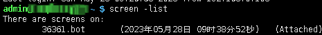

### 后台运行（Windows）

参考 [【知乎】如何在Windows下编写在后台一直运行的Python程序？](https://www.zhihu.com/question/30717692/answer/2547874093)

## Over

机器人初始化的基本操作就是这些了~
