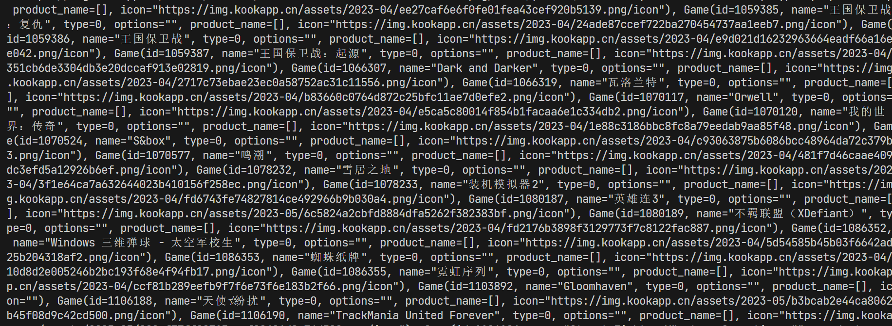
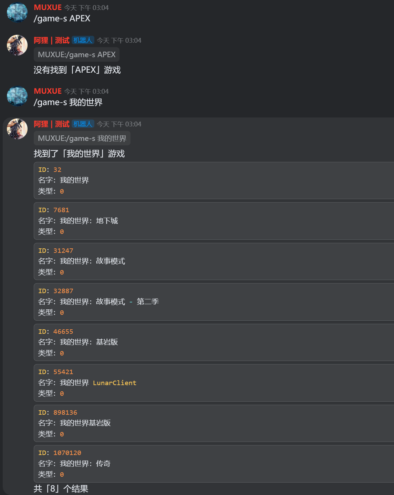
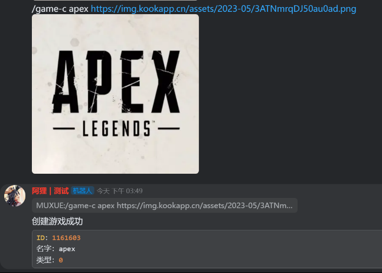
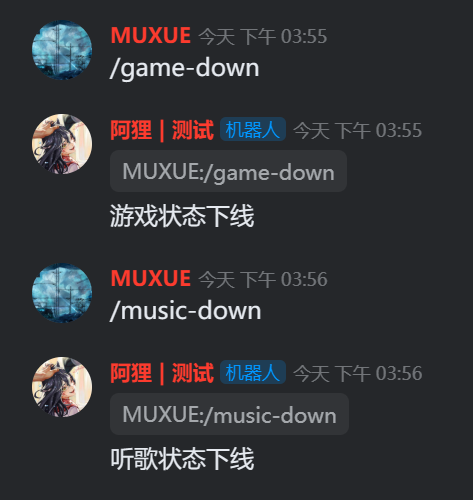

对应官方接口文档 [用户动态相关接口-游戏/进程/音乐](https://developer.kookapp.cn/doc/http/game)

## 1.查看所有游戏

~~~python
await bot.client.fetch_game_list()
~~~

测试示例

~~~python
import traceback
from khl import Bot, Message
from utils.file import open_file, write_file

# 打开config.json
config = open_file('./config/config.json')

# 初始化机器人
bot = Bot(token=config['token'])  # 默认采用 websocket


@bot.command(name='game-list')
async def test_cmd(msg: Message):
    try:
        print("get /game-list cmd")
        ret = await bot.client.fetch_game_list()
        print(ret)  # 打印游戏列表
    except:
        print(traceback.format_exc()) # 如果出现异常，打印错误


print("bot start")
bot.run()
~~~

在控制台会打印出当前已有的游戏 list，内部包含了多个 `Game` 对象。

注意，这个 list 并不符合 json 的格式要求，所以不能写入 json 文件。



## 2.查找目标游戏

为了方便找到自己想要的游戏是否已经被他人创建过了，你可以使用如下代码进行筛选

~~~python
game_name = "需要查找游戏的名字"
games = await bot.client.fetch_game_list()
target_games = [] # 结果列表
# 遍历查找
for g in games:
    # 使用模糊匹配，只要用户需要查找的游戏名字包含在其中，就添加到结果列表中
    # lower() 函数用于将str的大写转为小写，保证能匹配上
    if game_name.lower() in g.name.lower():
        target_games.append(g) # 插入 Game 对象
        
# list 为空代表没有找到
if target_games == []:
    print("没有找到")
else:
    print("找到了")
    print(target_games)
~~~

将其注册为命令，该命令有一个 `game_name` 参数作为我们需要查找的游戏名字。若找到了对应游戏，机器人将返回游戏的基本信息。

~~~python
@bot.command(name='game-s')
async def game_search_cmd(msg: Message,game_name:str):
    try:
        print("get /game-s cmd")
        games = await bot.client.fetch_game_list()
        target_games = [] # 结果列表
        # 遍历查找
        for g in games:
            # 使用模糊匹配，只要用户需要查找的游戏名字包含在其中，就添加到结果列表中
            if game_name.lower() in g.name.lower():
                target_games.append(g) # 插入 Game 对象
        # list 为空代表没有找到
        if target_games == []:
            await msg.reply(f"没有找到「{game_name}」游戏")
        else:
            text = f"找到了「{game_name}」游戏\n"
            for game in target_games:
                text+= "```\n"
                text+= f"ID：{game.id}\n"
                text+= f"名字：{game.name}\n"
                text+= f"类型：{game.type}\n"
                text+= "```\n"
            text+= f"共「{len(target_games)}」个结果" 
            # 更多游戏信息参考 https://developer.kookapp.cn/doc/http/game 对 game 对象的定义
            # 机器只需要获取到 game.id ，就能上在玩状态
            await msg.reply(text)
    except:
        print(traceback.format_exc())  # 如果出现异常，打印错误
~~~

命令执行效果如下



## 3.创建游戏

传入对应参数，将创建游戏，并返回 Game 对象。

游戏图标 url 获取：[获取图片 url 的办法](/pages/c68749/)

~~~python
name = "游戏名字"
icon = "游戏图标的图片url"
game = await bot.client.register_game(name, icon=icon)
~~~

命令示例

~~~python
@bot.command(name='game-c')
async def game_create_cmd(msg: Message, name: str, icon=None):
    try:
        print("get /game-c cmd")
        # 处理 icon
        if icon != None and 'http' in icon:
            # 从命令行获取到的url，是kmd格式的，[url](url)，我们需要取出其中一个完整的url
            # 否则无法获取到图片，报错 Requesting 'POST game/create' failed with 40000: 无法获取文件信息
            index = icon.find('](')
            icon = icon[index+2:-1] # 取到完整url
            print(f"icon url:{icon}")
        # 创建游戏
        game = await bot.client.register_game(name, icon=icon)
        # 发送信息
        text = "创建游戏成功\n"
        text += "```\n"
        text += f"ID：{game.id}\n"
        text += f"名字：{game.name}\n"
        text += f"类型：{game.type}\n"
        text += "```\n"
        await msg.reply(text)
    except:
        print(traceback.format_exc())  # 如果出现异常，打印错误
~~~

命令使用效果如下



控制台输出如下

~~~
get /game-c cmd
icon url:https://img.kookapp.cn/assets/2023-05/3ATNmrqDJ50au0ad.png
~~~

这里我们就获取到了游戏的 ID，在后续更新在玩状态的操作中，就需要使用到这个 ID

## 4.更新在玩状态

### 游戏

~~~python
game_id = 1161603 # 目标游戏ID，需要通过创建游戏获取，或者在所有游戏列表中查找
await bot.client.update_playing_game(game_id)
~~~

### 音乐

~~~python
name = "歌名"
singer = "歌手"
# 枚举值：['cloudmusic'、'qqmusic'、'kugou']，默认为'cloudmusic'
platfrom = "音乐平台"

await bot.client.update_listening_music(name, singer, platfrom)
~~~

### 命令示例

~~~python
@bot.command(name='game-up')
async def game_up_cmd(msg: Message, game_id: int):
    try:
        print("get /game-up cmd")
        # 传入 Game 对象，或者游戏的ID
        await bot.client.update_playing_game(game_id)
        await msg.reply(f"游戏「{game_id}」上线")
    except:
        print(traceback.format_exc())  # 如果出现异常，打印错误
        
@bot.command(name='music-up')
async def music_up_cmd(msg: Message, name: str, singer: str):
    try:
        print("get /music-up cmd")

        # 软件名，枚举值：['cloudmusic'、'qqmusic'、'kugou']，默认为'cloudmusic'
        platfrom = SoftwareTypes.KUGOU_MUSIC  # 酷狗音乐
        # 传入歌名，歌手，音乐平台
        await bot.client.update_listening_music(name, singer, platfrom)
        await msg.reply(f"开始听歌\n歌名：{name}\n歌手：{singer}")
    except:
        print(traceback.format_exc())  # 如果出现异常，打印错误
~~~

执行命令，键入本文档中创建的 AEPX 游戏的 ID


稍等一会（在玩状态同步较慢）就能在机器人的状态列表中，看到游戏状态


----

键入歌手和歌名，开始听歌状态


稍等一会（在玩状态同步较慢）就能在机器人的状态列表中，看到听歌状态


## 5.取消在玩状态

### 游戏

~~~python
await bot.client.stop_playing_game()
~~~

### 音乐

~~~python
await bot.client.stop_listening_music()
~~~

### 命令示例

~~~python
@bot.command(name='music-down')
async def music_down_cmd(msg: Message):
    try:
        print("get /music-down cmd")
        await bot.client.stop_listening_music()
        await msg.reply(f"听歌状态下线")
    except:
        print(traceback.format_exc())  # 如果出现异常，打印错误

@bot.command(name='game-down')
async def game_down_cmd(msg: Message):
    try:
        print("get /game-down cmd")
        await bot.client.stop_playing_game()
        await msg.reply(f"游戏状态下线")
    except:
        print(traceback.format_exc())  # 如果出现异常，打印错误 
~~~

