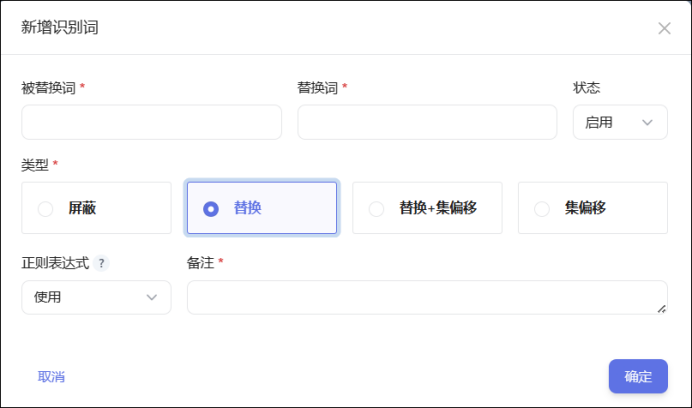
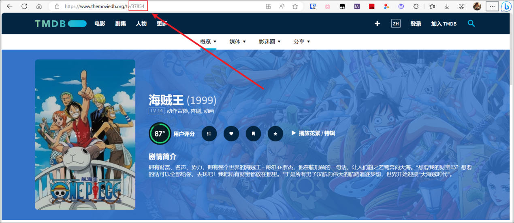
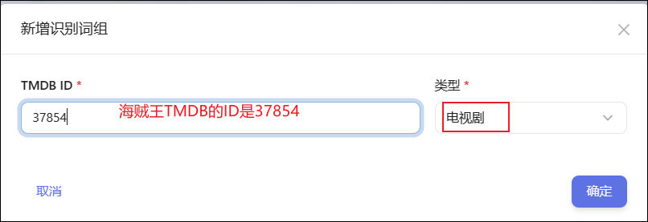
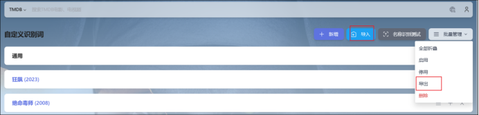
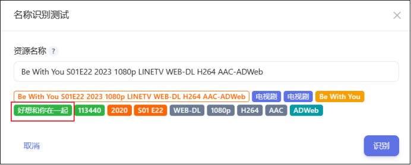
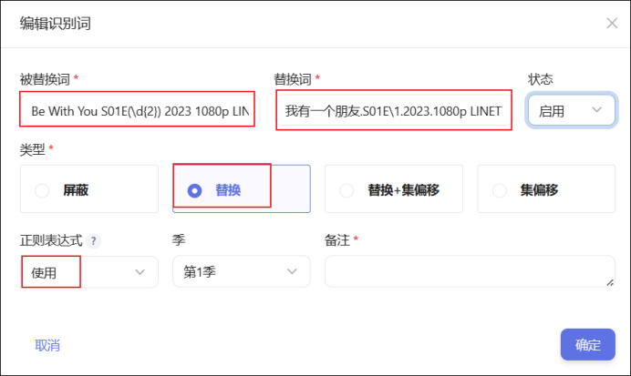
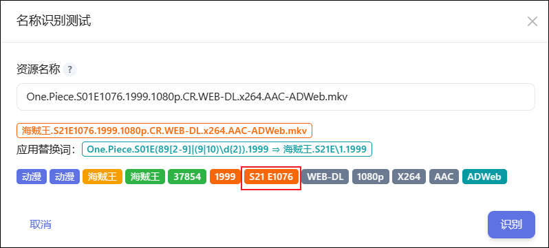
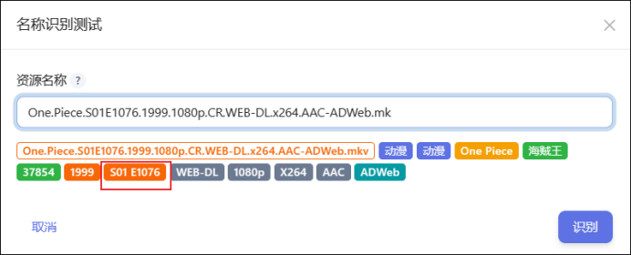
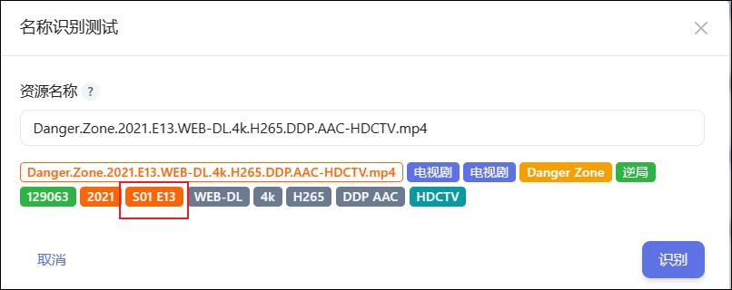
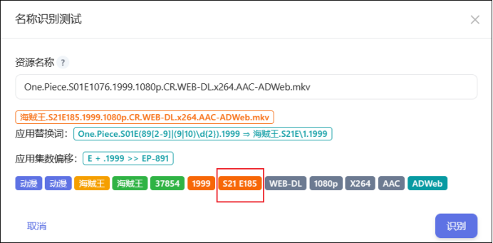

## 使用说明

- 当种子名称、文件名称无法识别时，可以通过自定义识别词对原名称进行修改，以符合`搜索订阅`（种子名称）、`刮削`（文件名称）的识别要求。
- 自定义识别词可以搭配`名称识别测试`插件一起使用。

## 使用教程
**1) 新增识别词**

我们进入自定义识别词页面可以看到有一个默认的识别词组【通用】，点击右边的+可以新增识别词。

新增识别词界面可以先选择不同的类型，有`屏蔽`、`替换`、`替换+集偏移`、`集偏移`，不同的类型需要填写不同的信息，比如替换需要填写被替换词和替换词。

- **屏弊**：将`被替换词`从待识别文本中去除。
- **替换**：使用`替换词`替换掉待识别文本中的`被替换词`部分。
- **集偏移**：定位待识别文本中的`集数位置`，并对识别出来的集数做运算，以解决识别出来的的集数与 TMDB 实际不一致的问题。`前后定位词`之间的所有数字视为集数。`偏移集数`支持运算，例如集数加 1：`EP+1`；集数翻倍：`2*EP`；集数翻倍-1：`2*EP-1`（`EP`代表原集数）。
- **替换+集偏移**：替换的同时，完成集偏移操作。

> 正则表达式：以上均支持使用正则表达式，使用 Python regex 模块，集偏移必须使用正则表达式。

**2）识别词组**

对于电视剧或者动漫这种可能所需的识别词比较多的时候，我们可以选择新增识别词组来方便管理和分享。

比如针对海贼王，我们先在TMDB里查找到它的ID：37854。

然后点击右上角的【新增】来新增个识别词组。

填写ID和选择类型：

填写完成后创建了个海贼王的词组，我们一样的可以点击后方的+来新增识别词。

>注意不管是通用还是新增识别词组，作用范围都是全局，所以在设置识别词时应尽可能定义复杂的匹配条件，以避免产生误定义。

**3）分享识别词**

通过导入按钮我们可以将别人分享的识别词导入使用。

通过批量管理--导出按钮我们可以将选中的识别词/识别词组导出为一串长文本，分享给他人使用。

>分享时应填写备注，以便别人导入时能知道是什么。

**4）状态管理**

可以通过批量管理--启用、停用按钮更改选中的识别词/识别词组的状态，也可以在每个具体的识别词里更改状态为启用、停用。

## 使用案例

**1）订阅我有一个朋友**

这是某站的我有一个朋友的种子名称：`Be With You S01E22 2023 1080p LINETV WEB-DL H264 AAC-ADWeb`，如果我们直接识别的话，它会识别成另一部剧，这时候我们订阅肯定不准确。

这个时候我们就需要用上自定义识别词了。

- 类型：`替换`

- 被替换词：`Be With You S01E(\d{2}) 2023 1080p LINETV WEB-DL`

- 替换词：`我有一个朋友.S01E\1.2023.1080p LINETV WEB-DL`

**说明：**

- 被替换词里的【(\d{2})】是说匹配任何一个两位数字的字符串，在这里代表名称里的22。

- 替换词里的【\1】是代表了被替换词里的【\d{2}】，也就是22。

现在我们重新来识别看看，发现能正确识别：

**2）刮削海贼王**

我们再以海贼王来重新巩固下识别词，以及看看集偏移的使用。

我们知道海贼王的TMDB里一共分了21季。但是有些时候站点的种子文件名并没有划分到具体的季数，全划分到了第一季。

比如在某站下载的种子文件名称：`One.Piece.S01E1076.1999.1080p.CR.WEB-DL.x264.AAC-ADWeb.mkv`，它会识别成第一季，这对刮削很不友好。

下面我们来编辑个自定义识别词。

- 类型：`替换+集偏移`
- 被替换词：`One.Piece.S01E(89[2-9]|(9|10)\d{2}).1999`
- 替换词：`海贼王.S21E\1.1999`
- 前定位词：`E`
- 后定位词：`.1999`
- 偏移集数：`EP-891`

说明：
- 被替换词里的【(89[2-9]|(9|10)\d{2})】代表了892-1099集。 其中：
    - `89[2-9]`匹配的是以 "89" 开头，后跟一个在 2-9 之间的数字的字符串。这里也就是说匹配892-899集。
    - `(9|10)\d{2}`里的(9|10)是一个选择性的正则表达式，它会匹配以 9 开头的数字或以 10 开头的数字，\d{2}是说匹配任何一个两位数字的字符串。【(9|10)\d{2}】就是匹配900-1099集。

- 替换词里的`\1`是指的是被替换词里的`(89[2-9]|(9|10)\d{2})`。

- 我们的集数前面的字符是`E`，后面是`.1999`，因此前定位词和后定位词就写这两个。
- 因为我们的892集是第21季的第一集，使用偏移集数减去891即可。

重新识别，成功的识别成了第21季。

