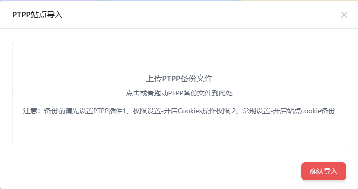

## 插件说明

> PTPP站点导入
- 插件Logo：
- 

### 1.安装插件
- 登陆MSber打开 我的插件/插件市场/PTPP站点导入/安装
### 2.插件使用
- 您需要先打开[PTPP助手](https://github.com/pt-plugins/PT-Plugin-Plus)浏览器插件在浏览器左侧菜单栏找到 权限设置-开启Cookiesi操作权限 和 常规设置-开启站点cookie备份
- 在左侧菜单栏找到 参数备份与恢复-点击备份-浏览器会自动下载备份文件
- 回到MSber界面打开PTPP站点导入将下载的数据备份文件上传或拖拽到显示框内确认导入即可
    
- 插件显示框：
- 
