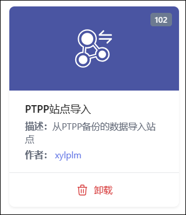
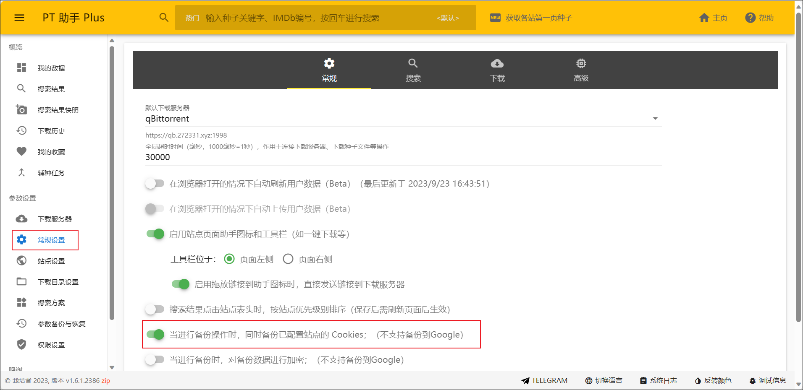

## 插件说明
可以通过此插件上传PTPP备份文件，直接导入站点信息。

### 插件使用
1、打开[PTPP助手](https://github.com/pt-plugins/PT-Plugin-Plus)浏览器插件，然后设置两个权限： `权限设置-开启Cookiesi操作权限` 和 `常规设置-开启站点cookie备份`

2、打开`参数备份与恢复`，点击`备份`，浏览器会自动下载个备份文件。

3、回到MS界面打开PTPP站点导入插件，将下载的备份文件上传到框内然后点击确认导入。

