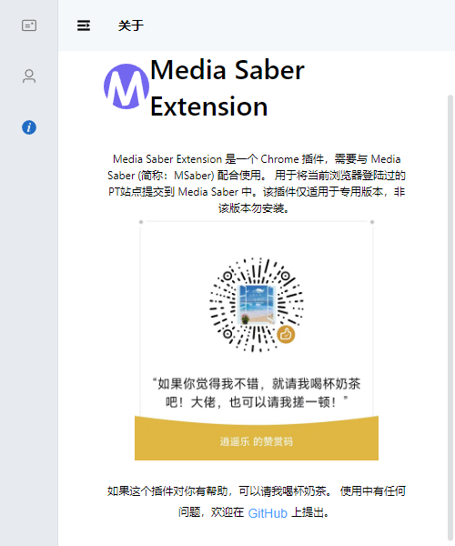

## 介绍

media saber 扩展效果示例，可以一键批量或者单个维护更新 MS 的 cookie 和 UA

## 插件安装

### Edge 扩展商店安装

插件已上架 Edge 扩展商店，搜索 NT Extension 直接安装

### 手动安装

也可以下载后手动安装，下载地址：
我用夸克网盘分享了「MediaSaber 浏览器扩展」，点击链接即可保存。打开「夸克 APP」，无需下载在线播放视频，畅享原画 5 倍速，支持电视投屏。
链接：https://pan.quark.cn/s/e50f9881c67d
提取码：fGGH

## 插件说明

可以看看 redeme.txt 文件说明，添加浏览器白名单。注意 9999 是白名单 id，不能重复，如果你 ptpp 用了相同 id，就换一个数字
扩展在 Media-Saber-Extension.v1.1.0.crx.zip 文件中。注意不能直接改后缀名，我做了二次压缩的，因此需要先解压。
