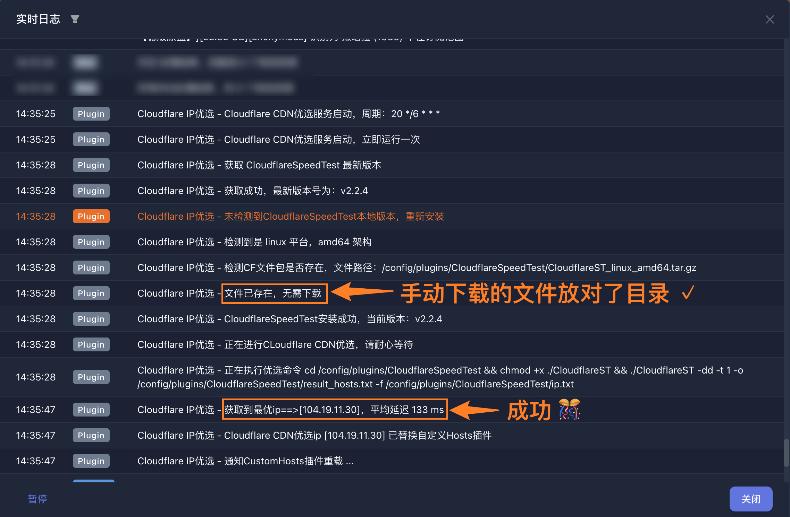

## 插件说明

CloudflareSpeedTest IP 优选插件

> 必须开启自定义 Hosts 插件

- **优选 ip**：自定义 hosts 中需要定时更新的域名 ip。
- **优选周期**：5 位 cron 表达式（分 时 天 月 周）。 格式参考：[cron 表达式](/docs/other/cron_rule)
- **自动校准**：开启后会获取自定义 Hosts 插件中，出现频率最高的 ip 作为优选 ip。
- **高级参数**：`-dd -t 1`，可大大减少优选时间（-dd:禁用测速；-t 1 失败一次后放弃）。

**注意问题：**

- 打开站点，F12 看请求的 response 的 Server 属性，如果是·cloudflare·，则可添加到自定义 Hosts 插件。
- cf 优选插件当前版本显示暂未安装： 1.基础设置—日志等级调整为`debug`，`docker logs -f ms`容器名看插件执行日志排查问题。 2.如果没有设置代理服务器添加代理服务器试试， 如果设置已代理服务器，把代理服务器删掉试试（本地或者梯子网络访问 github api 受限）。

## 插件安装

### 自动安装

正常情况下 插件启动会自动下载 CF 测速包，但是因为网络原因会下载失败，此时需要手动安装

### 手动安装

插件启动会自动下载 CF 测速包，但是因为网络原因会下载失败，
可以手动下载 CF 包，根据日志提示链接下载依赖包，放到 config/plugins/CloudflareSpeedTest 目录下
mac x86: CloudflareST_darwin_amd64.zip

- 大部分人是这个（linux x86）: CloudflareST_linux_amd64.tar.gz
  注意多次下载会带上(1)、(2)之类的标记，需要删除
  下载地址：https://github.com/XIU2/CloudflareSpeedTest/releases

以极空间 Z4S 举例：

这是文件夹层次关系（和上面极空间一样）

- CloudflareSpeedTest 这个文件夹名字不能输入错误（笑
- 下载对应系统的文件
  

执行步骤：



若安装失败，可能是权限问题，容器内执行：

```shell
chown -R ms:ms /config/plugins/CloudflareSpeedTest
```
