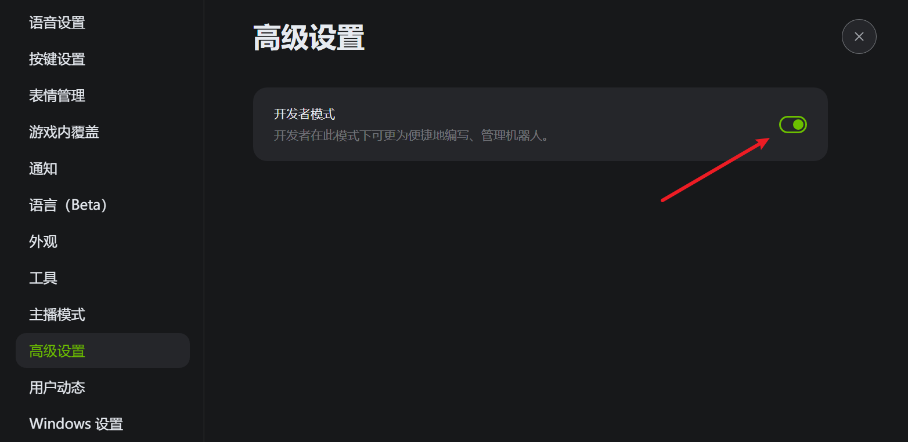
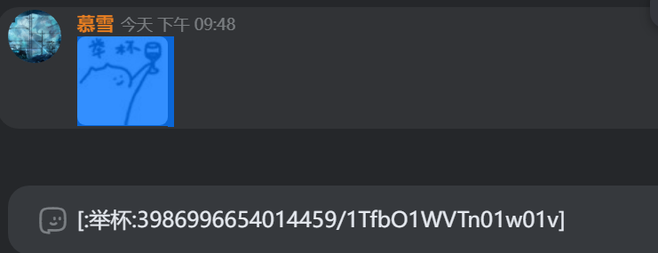

## 设置

在kook客户端/网页版设置中，开启 `高级设置-开发者模式`

## 服务器ID

右键服务器头像，复制ID

## 频道/分组ID

右键频道或频道分组，复制ID

## 用户ID

在公共频道聊天框，或者服务器用户列表，右键用户头像，复制ID

## 角色ID

进入服务器设置，角色权限，右键角色，复制ID

## 表情ID

发送自定义表情后，鼠标框选选择这个表情，当表情变蓝后，`ctrl+c`复制表情ID

注意，用户自定义表情是无法使用机器人发送的！

机器人只能发送其所在频道中的服务器表情，和kook内置的emoji