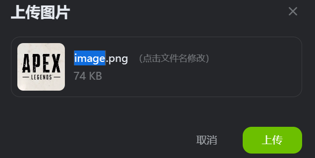
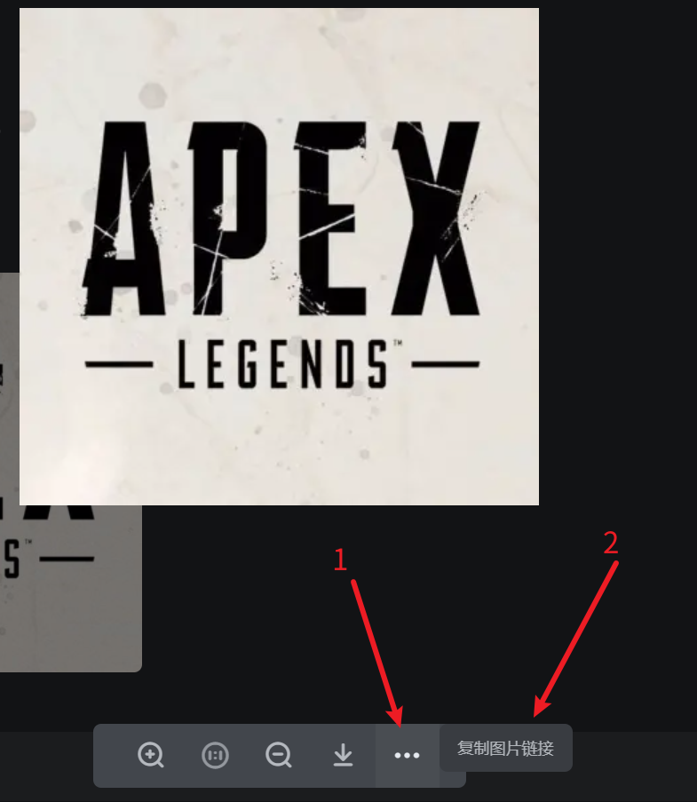

## 1.先上传图片

先在 kook 中上传图片

## 2.获取图片 url

上传图片后，点击聊天框的图片，进入大图

点击下方 `...`，复制图片的链接

即获取到了图片的 url

~~~
https://img.kookapp.cn/assets/2023-05/3ATNmrqDJ50au0ad.png
~~~

> 由于 KOOK 图片防盗链机制，您可能无法在本站看到上方图片。